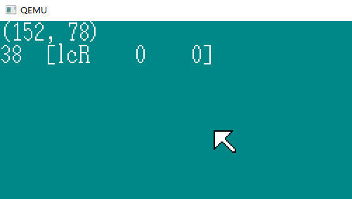

# 鼠标控制与32位模式切换

## 1.鼠标解读

HariMain（） ：

```C
	unsigned char mouse_dbuf[3], mouse_phase;
	enable_mouse();
	mouse_phase = 0; /* 进入到等待鼠标的0xfa的状态 */
	for (;;) {
		io_cli();
		if (fifo8_status(&keyfifo) + fifo8_status(&mousefifo) == 0) {
			io_stihlt();
		} else {
            // 处理键盘中断
			if (fifo8_status(&keyfifo) != 0) {
				i = fifo8_get(&keyfifo);
				io_sti();
				sprintf(s, "%02X", i);
				boxfill8(binfo->vram, binfo->scrnx, COL8_008484,  0, 16, 15, 31);
				putfonts8_asc(binfo->vram, binfo->scrnx, 0, 16, COL8_FFFFFF, s);
			}	// 处理鼠标中断 
            else if (fifo8_status(&mousefifo) != 0) {
				i = fifo8_get(&mousefifo);
				io_sti();
				if (mouse_phase == 0) {
					/* 等待鼠标的0xfa的状态 */
					if (i == 0xfa) {
						mouse_phase = 1;
					}
                	} else if (mouse_phase == 1) {
                    	/* 等待鼠标的第一字节 */
						mouse_dbuf[0] = i;
						mouse_phase = 2;
					} else if (mouse_phase == 2) {
						/* 等待鼠标的第二字节 */
						mouse_dbuf[1] = i;
						mouse_phase = 3;
					} else if (mouse_phase == 3) {
						/* 等待鼠标的第三字节 */
						mouse_dbuf[2] = i;
						mouse_phase = 1;
						/* 鼠标的3个字节都齐了，显示 */
						sprintf(s, "%02X %02X %02X", mouse_dbuf[0], mouse_dbuf[1], mouse_dbuf[2]);
						boxfill8(binfo->vram, binfo->scrnx, COL8_008484, 32, 16, 32 + 8 * 8 - 1, 31);
						putfonts8_asc(binfo->vram, binfo->scrnx, 32, 16, COL8_FFFFFF, s);
				}
			}
		}
	}
```

每次鼠标中断产生的数据是3BYTE一组，利用mouse_phase记录阶段（phase）。


移动鼠标时， 第一位在 0~3 波动  第二位  移动鼠标为8  左键为9 右键为A，滑轮 8~F，中间的字节与鼠标的左右移动有关，最后的字节与鼠标上下移动有关。

## 2.整理代码

bootpack.c

```C
struct MOUSE_DEC {
	unsigned char buf[3], phase;
};
extern struct FIFO8 keyfifo, mousefifo;
void enable_mouse(struct MOUSE_DEC *mdec);
void init_keyboard(void);
int mouse_decode(struct MOUSE_DEC *mdec, unsigned char dat);
void HariMain(void)
{
	struct BOOTINFO *binfo = (struct BOOTINFO *) ADR_BOOTINFO;
	char s[40], mcursor[256], keybuf[32], mousebuf[128];
	int mx, my, i;
	struct MOUSE_DEC mdec;
	init_gdtidt();
	init_pic();
	io_sti(); /* IDT/PICの初期化が終わったのでCPUの割り込み禁止を解除 */
	fifo8_init(&keyfifo, 32, keybuf);
	fifo8_init(&mousefifo, 128, mousebuf);
	io_out8(PIC0_IMR, 0xf9); /* PIC1とキーボードを許可(11111001) */
	io_out8(PIC1_IMR, 0xef); /* マウスを許可(11101111) */
	init_keyboard();
	init_palette();
	init_screen8(binfo->vram, binfo->scrnx, binfo->scrny);
	mx = (binfo->scrnx - 16) / 2; /* 画面中央になるように座標計算 */
	my = (binfo->scrny - 28 - 16) / 2;
	init_mouse_cursor8(mcursor, COL8_008484);
	putblock8_8(binfo->vram, binfo->scrnx, 16, 16, mx, my, mcursor, 16);
	sprintf(s, "(%d, %d)", mx, my);
	putfonts8_asc(binfo->vram, binfo->scrnx, 0, 0, COL8_FFFFFF, s);
	enable_mouse(&mdec);
	for (;;) {
		io_cli();
		if (fifo8_status(&keyfifo) + fifo8_status(&mousefifo) == 0) {
			io_stihlt();
		} else {
			if (fifo8_status(&keyfifo) != 0) {
				i = fifo8_get(&keyfifo);
				io_sti();
				sprintf(s, "%02X", i);
				boxfill8(binfo->vram, binfo->scrnx, COL8_008484,  0, 16, 15, 31);
				putfonts8_asc(binfo->vram, binfo->scrnx, 0, 16, COL8_FFFFFF, s);
			} else if (fifo8_status(&mousefifo) != 0) {
				i = fifo8_get(&mousefifo);
				io_sti();
				if (mouse_decode(&mdec, i) != 0) {
					/* データが3バイト揃ったので表示 */
					sprintf(s, "%02X %02X %02X", mdec.buf[0], mdec.buf[1], mdec.buf[2]);
					boxfill8(binfo->vram, binfo->scrnx, COL8_008484, 32, 16, 32 + 8 * 8 - 1, 31);
					putfonts8_asc(binfo->vram, binfo->scrnx, 32, 16, COL8_FFFFFF, s);
				}
			}
		}
	}
}
void enable_mouse(struct MOUSE_DEC *mdec)
{
	/* 鼠标有效 */
	wait_KBC_sendready();
	io_out8(PORT_KEYCMD, KEYCMD_SENDTO_MOUSE);
	wait_KBC_sendready();
	io_out8(PORT_KEYDAT, MOUSECMD_ENABLE);
	/* 顺利的话，ACK（0xfa）会被送过来  TAKR-Zz */
	mdec->phase = 0; /* 等待0xfa的阶段 */
	return;
}
int mouse_decode(struct MOUSE_DEC *mdec, unsigned char dat)
{
	if (mdec->phase == 0) {
		/* マウスの0xfaを待っている段階 */
		if (dat == 0xfa) {
			mdec->phase = 1;
		}
		return 0;
	}
	if (mdec->phase == 1) {
		/* マウスの1バイト目を待っている段階 */
		mdec->buf[0] = dat;
		mdec->phase = 2;
		return 0;
	}
	if (mdec->phase == 2) {
		/* マウスの2バイト目を待っている段階 */
		mdec->buf[1] = dat;
		mdec->phase = 3;
		return 0;
	}
	if (mdec->phase == 3) {
		/* マウスの3バイト目を待っている段階 */
		mdec->buf[2] = dat;
		mdec->phase = 1;
		return 1;
	}
	return -1; /* 应该不可能到这里来的 */
}
```

创建了结构体 MOUSE_DEC （decode）

## 3.鼠标解读（2）

bootpack.c :

```C
struct MOUSE_DEC {
	unsigned char buf[3], phase;
	int x, y, btn;
};
int mouse_decode(struct MOUSE_DEC *mdec, unsigned char dat)
{
	if (mdec->phase == 0) {
		/* マウスの0xfaを待っている段階 */
		if (dat == 0xfa) {
			mdec->phase = 1;
		}
		return 0;
	}
	if (mdec->phase == 1) {
		/* マウスの1バイト目を待っている段階 */
		if ((dat & 0xc8) == 0x08) {
			/* 正しい1バイト目だった */
			mdec->buf[0] = dat;
			mdec->phase = 2;
		}
		return 0;
	}
	if (mdec->phase == 2) {
		/* マウスの2バイト目を待っている段階 */
		mdec->buf[1] = dat;
		mdec->phase = 3;
		return 0;
	}
	if (mdec->phase == 3) {
		/* マウスの3バイト目を待っている段階 */
		mdec->buf[2] = dat;
		mdec->phase = 1; // 返回等待中断状态
		mdec->btn = mdec->buf[0] & 0x07; //00000111 记录左键右键滚轮
		mdec->x = mdec->buf[1];    		 // 记录左右移动
		mdec->y = mdec->buf[2];			 // 记录上下移动
		if ((mdec->buf[0] & 0x10) != 0) {   //00010000  第一位是 1或3
			mdec->x |= 0xffffff00;		 // 1111111100000000  x 是 int
            							// x = 111111111111111111111111x
		}
		if ((mdec->buf[0] & 0x20) != 0) {  //00100000 第一位是 2
			mdec->y |= 0xffffff00;		  // y = 111111111111111111111111y 
		}
		mdec->y = - mdec->y; /* y 取 反 */
		return 1;
	}
	return -1; /* ここに来ることはないはず */
}
```

x存储左右位移，y存储上下位移，btn存储鼠标按键状态。

HariMain（）：

```C
else if (fifo8_status(&mousefifo) != 0) {
		i = fifo8_get(&mousefifo);
		io_sti();
		if (mouse_decode(&mdec, i) != 0) {
			/* データが3バイト揃ったので表示 */
             sprintf(s, "[lcr %4d %4d]", mdec.x, mdec.y);
			if ((mdec.btn & 0x01) != 0) {  // 9, B, D, F
				s[1] = 'L';
			}
			if ((mdec.btn & 0x02) != 0) {  //  A, B, E, F
				s[3] = 'R';
			}
			if ((mdec.btn & 0x04) != 0) {  //  C, D, E, F
				s[2] = 'C';
			}
			boxfill8(binfo->vram, binfo->scrnx, COL8_008484, 32, 16, 32 + 15 * 8 - 1, 31);
			putfonts8_asc(binfo->vram, binfo->scrnx, 32, 16, COL8_FFFFFF, s);
		}
}
```



Left sCroller Right   x位移 y位移

## 4.移动鼠标指针

HariMain() :

```C
} else if (fifo8_status(&mousefifo) != 0) {
				i = fifo8_get(&mousefifo);
				io_sti();
				if (mouse_decode(&mdec, i) != 0) {
					/* データが3バイト揃ったので表示 */
					sprintf(s, "[lcr %4d %4d]", mdec.x, mdec.y);
					if ((mdec.btn & 0x01) != 0) {
						s[1] = 'L';
					}
					if ((mdec.btn & 0x02) != 0) {
						s[3] = 'R';
					}
					if ((mdec.btn & 0x04) != 0) {
						s[2] = 'C';
					}
					boxfill8(binfo->vram, binfo->scrnx, COL8_008484, 32, 16, 32 + 15 * 8 - 1, 31);
					putfonts8_asc(binfo->vram, binfo->scrnx, 32, 16, COL8_FFFFFF, s);
					/* 鼠标指针的移动 */
					boxfill8(binfo->vram, binfo->scrnx, COL8_008484, mx, my, mx + 15, my + 15); /* マウス消す */
					mx += mdec.x;
					my += mdec.y;
					if (mx < 0) {
						mx = 0;
					}
					if (my < 0) {
						my = 0;
					}
					if (mx > binfo->scrnx - 16) {
						mx = binfo->scrnx - 16;
					}
					if (my > binfo->scrny - 16) {
						my = binfo->scrny - 16;
					}
					sprintf(s, "(%3d, %3d)", mx, my);
					boxfill8(binfo->vram, binfo->scrnx, COL8_008484, 0, 0, 79, 15); /* 隐藏坐标 */
					putfonts8_asc(binfo->vram, binfo->scrnx, 0, 0, COL8_FFFFFF, s); /* 显示坐标 */
					putblock8_8(binfo->vram, binfo->scrnx, 16, 16, mx, my, mcursor, 16); /* 画鼠标指针 */
				}
			}
```

## 5.32位

asmhead.nas :

```assembly
; PIC关闭一切中断
;	根据AT兼容机的规格，如果要初始化PIC
;	必须在CLI之前进行，否则有时会挂起
;	随后进行PIC的初始化
		MOV		AL,0xff
		OUT		0x21,AL
		NOP						; 如果连续执行OUT指令，有些机种将无法正常运行？流水线？
		; NOP指令让CPU休息一个时钟周期  也就是一个Bubble
		OUT		0xa1,AL
		CLI						; さらにCPUレベルでも割り込み禁止
```

​	等同与

```C
io_out(PIC0_IMR, 0xff);  // 禁止主PIC的全部中断
io_out(PIC1_IMR, 0xff);  // 禁止从PIC的全部中断
io_cli();				// 禁止CPU级别的中断
```

```assembly
; 为了让CPU能够访问1MB以上的内存空间，设定A20GATE
		CALL	waitkbdout
		MOV		AL, 0xd1
		OUT		0x64, AL
		CALL	waitkbdout
		MOV		AL, 0xdf			; enable A20
		OUT		0x60, AL
		CALL	waitkbdout
```

waikbdout等同于wait_KBC_sendready。

```C
#define KEYCMD_WRITE_OUTPORT     0xd1
#define KBC_OUTPORT_A20G_ENABLE  0xdf

	wait_KBC_sendready();
	io_out8(PORT_KEYCMD, KEYCMD_WRITE_OUTPORT);
	wait_KBC_sendready();
	io_out8(PORT_KEYDAT, KBC_OUTPORT_A20G_ENABLE);
	wait_KBC_sendready();	// 等待完成执行指令
```

此段与init_keyboard()完全相同 。

其中在PORT_KEYDAT 中发出的KBC_OUTPORT_A20G_ENABLE 0xdf，连接着主板的很多地方，通过这个端口发送不同的指令，就可以实现各种各样的控制功能。

这次0xdf，是让A20GATE信号线变成ON的状态。这个信号线能让内存1MB以上的部分变成可用状态。

最后的wait_KBC_sendready()是多余的，等待下一个指令。

```assembly
[INSTRSET "i486p"]				; 想要使用486指令的叙述

		LGDT	[GDTR0]			; 设定临时 GDT
		MOV		EAX,CR0
		AND		EAX,0x7fffffff	; 设bit31为0
		OR		EAX,0x00000001	; bit0为1 切换到保护模式
		MOV		CR0,EAX
		JMP		pipelineflush
pipelineflush:
		MOV		AX,1*8			;  可读写的段   32bit
		MOV		DS,AX
		MOV		ES,AX
		MOV		FS,AX
		MOV		GS,AX
		MOV		SS,AX
```

**INSTRSET** 是为了使用386以后的LGDT、EAX、CR0等关键字

将CR0的最高位置为0，最低为置为1。完成模式转换，进入到不用颁的保护模式。CR0也就是controlregister0，只有操作系统能操作。

[^1]: protected virtual address mode，受保护的虚拟内存地址模式  以前的16位模式称为real(address)mode，也就是实际地址模式。模式的区别在于，在计算内存地址时，是使用段寄存器的值直接指定地址值的一部分，还是通过GDT使用段寄存器的值指定并非实际存在的地址号码。

```assembly
; bootpack的转送

		MOV		ESI,bootpack	; 转送源
		MOV		EDI,BOTPAK		; 转送目的地
		MOV		ECX,512*1024/4
		CALL	memcpy

; 磁盘数据最终转送到它本来的位置去

; 首先从启动扇区开始

		MOV		ESI,0x7c00		; 转送源
		MOV		EDI,DSKCAC		; 转送目的地
		MOV		ECX,512/4
		CALL	memcpy

; 所有剩下的

		MOV		ESI,DSKCAC0+512	; 源
		MOV		EDI,DSKCAC+512	; 目的地
		MOV		ECX,0
		MOV		CL,BYTE [CYLS]
		IMUL	ECX,512*18*2/4	; シリンダ数からバイト数/4に変換
		SUB		ECX,512/4		; IPLの分だけ差し引く
		CALL	memcpy
```

```C
memcpy(bootpack,	BOTPAK,		512*1024/4);
memcpy(0x7c00,		DSKCAC,		512/4);
memcpy(DSKCAC0+512,	 DSKCAC+512, cyls*512*18*2/4 - 512/4);
```

memcpy(转送源地址, 转送目的地址, 转送数据大小);

转送数据大小 以 柱面数 计算，需要减去启动区的那一部分长度。 IMUL 乘法  SUB 减法

haribote.sys 是 asmhead.bin 和 bootpack.hrb 连接起来而生成的

```assembly
; 必须由asmhead的工作已经全部完成
;	以后就交由bootpack来完成

; bootpack的启动

		MOV		EBX,BOTPAK
		MOV		ECX,[EBX+16]
		ADD		ECX,3			; ECX += 3;
		SHR		ECX,2			; ECX /= 4;
		JZ		skip			; 没有要转送的东西时
		MOV		ESI,[EBX+20]	; 转送源
		ADD		ESI,EBX
		MOV		EDI,[EBX+12]	; 转送目的地
		CALL	memcpy
skip:
		MOV		ESP,[EBX+12]	; 栈初始值
		JMP		DWORD 2*8:0x0000001b
```

**SHR**右移运算

**JZ**条件跳转 *jump if zero* 根据前一个计算结果是否为0决定跳转


```
内存分布图： 
0x00000000 - 0x000fffff : 虽然在启动中会多次使用，但之后就为空（1MB）
0x00100000 - 0x00267fff : 用于保存软盘的内容。（1440KB）
0x00268000 - 0x0026f700 ： 空（30KB）
0x0026f800 - 0x0026ffff ： IDT（2KB）
0x00270000 - 0x0027ffff ： GDT（64KB）
0x00280000 - 0x002fffff ： bootpack.hrb（512KB）
0x00300000 - 0x003fffff ： 栈及其他（1MB）
0x00400000 -            :  空
```

最初的1MB还存在BIOS、VRAM等内容。

```assembly
waitkbdout:
		IN		 AL,0x64
		AND		 AL,0x02
		IN 		 AL,0x60         ; 空读，为了清空垃圾数据
		JNZ		waitkbdout		; AND的结果如果不是0，就跳到开头
		RET
```

于wait_KBC_sendready()相同，但也添加了处理部分。

**JNZ** *jump if not zero*

```assembly
memcpy:
		MOV		EAX,[ESI]
		ADD		ESI,4
		MOV		[EDI],EAX
		ADD		EDI,4
		SUB		ECX,1
		JNZ		memcpy			; 减法结果如果不是0，就会跳
		RET
; memcpyはアドレスサイズプリフィクスを入れ忘れなければ、ストリング命令でも書ける
```

```assembly
		ALIGNB	16
GDT0:
		RESB	8				; NULL selector
		DW		0xffff,0x0000,0x9200,0x00cf	; 可以读写的段segment 32bit
		DW		0xffff,0x0000,0x9a28,0x0047	; 可以执行的段segment 32bit（bootpack用）

		DW		0
GDTR0:
		DW		8*3-1
		DD		GDT0

		ALIGNB	16
bootpack:
```

**ALIGNB** 一直添加DBO，知道地址能被16整除的时候。

GDT0是一种特殊的GDT，0号是空区域，NULL selector，1号和2号分别由下式定义

```C
set_segmdesc(gdt + 1, 0xffffffff,	0x00000000, AR_DATA32_RW);
set_segmdesc(gdt + 2, LIMIT_BOTPAK,	ADR_BOTPAK,	AR_CDOE32_ER);
```

GDTR0是LGDT指令，意思是通知GDT0“有了GDT”，在GDT0中，写入了16位的段上限，和32位的段起始地址。

最初状态里，GDT是在asmhead.nas里的，并不在0x00270000~0x0027ffff的范围里。IDT还没设定处在中断禁止的状态，所以应在调色板初始化和画面的准备之前，赶紧创建GDT和IDT，并执行io_sti();

```C
void HariMain(void)
{
	struct BOOTINFO *binfo = (struct BOOTINFO *) ADR_BOOTINFO;
	char s[40], mcursor[256], keybuf[32], mousebuf[128];
	int mx, my, i;
	struct MOUSE_DEC mdec;

	init_gdtidt();
	init_pic();
	io_sti(); /* IDT/PIC的初始化已经完成，开放CPU中断 */
	fifo8_init(&keyfifo, 32, keybuf);
	fifo8_init(&mousefifo, 128, mousebuf);
	io_out8(PIC0_IMR, 0xf9); /* 开放PIC1和键盘中断（11111001） */
	io_out8(PIC1_IMR, 0xef); /* 开放鼠标中断（11101111） */

	init_keyboard();

	init_palette();
	init_screen8(binfo->vram, binfo->scrnx, binfo->scrny);
```

day 08 finish

TAKR-Zz