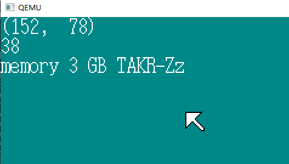
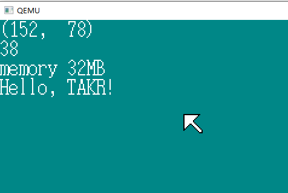
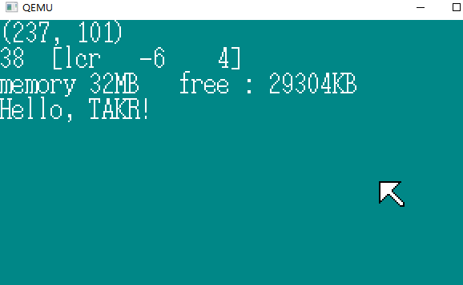

# 内存管理

## 1.整理源文件

|       函数名       |   移动前   |   移动后   |
| :----------------: | :--------: | :--------: |
| wait_KBC_sendready | bootpack.c | keyboard.c |
|   init_keyboard    | bootpack.c | keyboard.c |
|    enable_mouse    | bootpack.c |  mouse.c   |
|    mouse_decode    | bootpack.c |  mouse.c   |
|    inthandler21    |   init.c   | keyboard.c |
|    inthandler2c    |   init.c   |  mouse.c   |

## 2. 内存容量检查 (1)

检查内存容量：

+ 让CPU的cache无效
+ 往内存中写一个值，然后马上读取，检验是否相等

```C
#define EFLAGS_AC_BIT		    0x00040000
#define CR0_CACHE_DISABLE		0x60000000
unsigned int memtest(unsigned int start, unsigned int end)
{
	char flg486 = 0;
	unsigned int eflg, cr0, i;
	/* 确认CPU是386还是486以上的 */
	eflg = io_load_eflags();
	eflg |= EFLAGS_AC_BIT; /* AC-bit = 1 00000000000001000000000000000000 置为 1 */
	io_store_eflags(eflg);
	eflg = io_load_eflags();
	if ((eflg & EFLAGS_AC_BIT) != 0) { /* 如果是386，即使设定AC=1，AC的值还是回到0 */
		flg486 = 1;  // 说明是 486 以上的，具有缓存功能
	}
	eflg &= ~EFLAGS_AC_BIT; /* AC-bit = 0 */
	io_store_eflags(eflg);
	if (flg486 != 0) {
		cr0 = load_cr0();  // 读出CR0的值
		cr0 |= CR0_CACHE_DISABLE; /* 禁止缓存 011000000000000000000000000000000000 置为11 */
		store_cr0(cr0);    // 存回CR0的值
	}
	i = memtest_sub(start, end);
    // 恢复状态 
	if (flg486 != 0) {
		cr0 = load_cr0();
		cr0 &= ~CR0_CACHE_DISABLE; /* 允许缓存 */
		store_cr0(cr0);
	}
	return i;
}
```

eflag 写读值 检查CPU是486以上还是386

```assembly
_load_cr0:		; int load_cr0(void);
		MOV		EAX,CR0
		RET

_store_cr0:		; void store_cr0(int cr0);
		MOV		EAX,[ESP+4]
		MOV		CR0,EAX
		RET
```

内存检查部分的实现 ：

```C
unsigned int memtest_sub(unsigned int start, unsigned int end)
{
	unsigned int i, *p, old, pat0 = 0xaa55aa55, pat1 = 0x55aa55aa;
	for (i = start; i <= end; i += 0x1000) {	// 每次增加 2 ^ 15   4 KB
		p = (unsigned int *) (i + 0xffc);      // i + 16^3 - 
		old = *p;			/* 先记住修改前的值 */
		*p = pat0;			/* 试写 */
		*p ^= 0xffffffff;	/* 反转  ^异或  运算符 */ 
		if (*p != pat1) {	/* 检查反转结果 */
not_memory:
			*p = old;
			break;
		}
		*p ^= 0xffffffff;	/* 再次反转 */
		if (*p != pat0) {	/* 检查值是否恢复 */
			goto not_memory;
		}
		*p = old;			/* 恢复为修改前的值 */
	}
	return i;
}
```

 i 的值每次增加4是因为每次要检查4个字节 INT 是 4 BYTE，修改后的程序只检查每 4KB 的最后4个BYTE，因为这只是测量容量。

```C
	i = memtest(0x00400000, 0xbfffffff) / (1024 * 1024);
	sprintf(s, "memory %d GB TAKR-Zz", i);
	putfonts8_asc(binfo->vram, binfo->scrnx, 0, 32, COL8_FFFFFF, s);
```

3 * 2 ^ 30 最大可以测量 3GB的内存容量



## 3. 内存容量检查 (2)

但是QEMU虚拟机上根据模拟器的设定，内存应该为32MB。

在harib06b中通过 make -r bootpack.nas 运行，得到 ：

```assembly
_memtest_sub:
	PUSH	EBP
	MOV	EBP,ESP
	MOV	EDX,DWORD [12+EBP]
	MOV	EAX,DWORD [8+EBP]
	CMP	EAX,EDX     ;如果 start > end 就return
	JA	L30
L36:
L34:
	ADD	EAX,4096  
	CMP	EAX,EDX		; start + 4096 （0x1000） < L36  继续
	JBE	L36
L30:
	POP	EBP     	; EAX 是 返回的值 （i）
	RET
```

编译结果不正常，将中间的判断指令都忽略掉了，所以结果不正常。

原因 ： **编译器** 自作聪明，认为一定相等就直接忽略了，它的硬件知识不扎实，想不到会对没有内存的地方进行读写。

处理方式：将memtest_sub用汇编语言来写。

```assembly
_memtest_sub:	; unsigned int memtest_sub(unsigned int start, unsigned int end)
		PUSH	EDI						; （由于还要使用EBX、ESI、EDI）
		PUSH	ESI
		PUSH	EBX
		MOV		ESI,0xaa55aa55			; pat0 = 0xaa55aa55;
		MOV		EDI,0x55aa55aa			; pat1 = 0x55aa55aa;
		MOV		EAX,[ESP+12+4]			; i = start;
mts_loop:
		MOV		EBX,EAX
		ADD		EBX,0xffc				; p = i + 0xffc;
		MOV		EDX,[EBX]				; old = *p;
		MOV		[EBX],ESI				; *p = pat0;
		XOR		DWORD [EBX],0xffffffff	; *p ^= 0xffffffff;
		CMP		EDI,[EBX]				; if (*p != pat1) goto fin;
		JNE		mts_fin
		XOR		DWORD [EBX],0xffffffff	; *p ^= 0xffffffff;
		CMP		ESI,[EBX]				; if (*p != pat0) goto fin;
		JNE		mts_fin
		MOV		[EBX],EDX				; *p = old;
		ADD		EAX,0x1000				; i += 0x1000;
		CMP		EAX,[ESP+12+8]			; if (i <= end) goto mts_loop;
		JBE		mts_loop
		POP		EBX
		POP		ESI
		POP		EDI
		RET
mts_fin:
		MOV		[EBX],EDX				; *p = old;
		POP		EBX
		POP		ESI
		POP		EDI
		RET
```



## 4. 挑战内存管理

内存管理：内存分配、内存释放。

[^1]: 本书讲解的是分页式内存管理

假设有128MB的内存，页面大小4KB，即可以分为32K个页。书中说 需要32KB的空间来管理？如果管理表可以不用char来构成，而是用bit来构成，就会减少为1/8。Windows的软盘管理方法与这接近。

```
char a[32768];   //	空闲为0，使用为1
```

还有一种列表管理方法，将“从xxx号地址开始的yyy字节都是空着的”这种信息存在表中。

```C
struct FREEINFO{	// 可用状况
	unsigned int addr, size;
}
struct MEMMAN{  // MEMORY MANAGER
	int frees;		// 内存管理
	struct FREEINFO free[1000];
}

	struct MEMMAN memman;
	memman.frees = 1; /* 可用状况list中只有1件 */
	memman.free[0].addr = 0x00400000;
	memman.free[0].size = 0x07c00000;
```

使用内存更新表，释放内存合并内存。

这个方法的优点是 ： 

+ 占用空间少，8 * 1000 + 4 = 8004 B，与上一种方法的 32KB减少了很多，而且1000这个数字很充裕；
+ 在大块内存的分配和释放都很迅速。

缺点 ：

+ 管理程序变复杂
+ 可用空间变得零散，1000条FREEINFO可能用完。

为了解决上面的问题：

+ 暂时先割舍掉，当memman有空余时，再对内存进行检查，将割舍掉的那部分内容捡回来。
+ 切换回第一种管理方法。

**haribote OS采用先割舍掉的方法**

```C
#define MEMMAN_FREES		4090	/* 大约是32KB */
struct FREEINFO {	/* 可用信息 */
	unsigned int addr, size;
};

struct MEMMAN {		/* 内存管理 */
	int frees, maxfrees, lostsize, losts;
	struct FREEINFO free[MEMMAN_FREES];
};
void memman_init(struct MEMMAN *man) //	初始化
{
	man->frees = 0;			/* 可用信息数目 */
	man->maxfrees = 0;		/* 用于观察可用状况 ： frees的最大值 */
	man->lostsize = 0;		/* 释放失败的内存的大小总和 */
	man->losts = 0;			/* 释放失败的次数 */
	return;
}

unsigned int memman_total(struct MEMMAN *man)
/* 报告空余内存的大小 */
{
	unsigned int i, t = 0;
	for (i = 0; i < man->frees; i++) {
		t += man->free[i].size;
	}
	return t;
}

unsigned int memman_alloc(struct MEMMAN *man, unsigned int size)
/* 分配内存 */
{
	unsigned int i, a;
	for (i = 0; i < man->frees; i++) {
		if (man->free[i].size >= size) {
			/* 找到了足够大的内存 */
			a = man->free[i].addr;
			man->free[i].addr += size;
			man->free[i].size -= size;
			if (man->free[i].size == 0) {
				/* 如果free[i]变成了0，就减掉一条可用信息 */
				man->frees--;
				for (; i < man->frees; i++) 
                    					// 数据前移
					man->free[i] = man->free[i + 1]; /* 代入结构体 */
				}
			}
			return a;
		}
	}
	return 0; /* 没有可用空间 */
}

int memman_free(struct MEMMAN *man, unsigned int addr, unsigned int size)
/* 释放内存 */
{
	int i, j;
	/* 为便于归纳内存，将free[]按照addr的顺序排列 */
	/* 所以，先决定应该放在那里 */
	for (i = 0; i < man->frees; i++) {
		if (man->free[i].addr > addr) {
			break;
		}
	}
	/* free[i - 1].addr < addr < free[i].addr */
	if (i > 0) {
		/* 前面有可用内存 */
		if (man->free[i - 1].addr + man->free[i - 1].size == addr) {
			/* 可以与前面的可用内存归纳到一起 */
			man->free[i - 1].size += size;
			if (i < man->frees) {
				/* 后面也有 */
				if (addr + size == man->free[i].addr) {
					/* 可以和后面的归纳到一起 */
					man->free[i - 1].size += man->free[i].size;
					/* 清除 man->free[i] */
					/* free[i]变成0后归纳到前面去 */
					man->frees--;
					for (; i < man->frees; i++) {
						man->free[i] = man->free[i + 1]; /* 结构体赋值 */
					}
				}
			}
			return 0; /* 成功 */
		}
	}
	/* 不能与前面的空间归纳到一起 */
	if (i < man->frees) {
		/* 后面还有 */
		if (addr + size == man->free[i].addr) {
			/* 可以和后面的归纳到一起 */
			man->free[i].addr = addr;
			man->free[i].size += size;
			return 0; /* 成功 */
		}
	}
	/* 都不能归纳到一起 */
	if (man->frees < MEMMAN_FREES) {
		/* free[i]之后的，向后移动，腾出一个free的位置 */
		for (j = man->frees; j > i; j--) {
			man->free[j] = man->free[j - 1];
		}
		man->frees++;
		if (man->maxfrees < man->frees) {
			man->maxfrees = man->frees; /* 最大值更新 */
		}
		man->free[i].addr = addr;
		man->free[i].size = size;
		return 0; /* 成功 */
	}
	/* 不能往后移动 */
	man->losts++;
	man->lostsize += size;
	return -1; /* 失败了 */
}
```

HariMain() ：

```C
#define MEMMAN_ADDR			0x003c0000  //memman的地址
void HariMain(void)
{
	unsigned int memtotal;
	struct MEMMAN *memman = (struct MEMMAN *) MEMMAN_ADDR;
	memtotal = memtest(0x00400000, 0xbfffffff);
	memman_init(memman);
	memman_free(memman, 0x00001000, 0x0009e000); /* 0x00001000 - 0x0009efff */
	memman_free(memman, 0x00400000, memtotal - 0x00400000);
	sprintf(s, "memory %dMB   free : %dKB",
			memtotal / (1024 * 1024), memman_total(memman) / 1024);
	putfonts8_asc(binfo->vram, binfo->scrnx, 0, 32, COL8_FFFFFF, s);
	
```

memman 需要32KB，我们暂时使用0x003c0000开始的32KB（预计后期无法达到这个地址）然后计算memtotal，将现在不用的内存以0x1000个字节为单位注册到memman里。



day 09 finish

TAKR