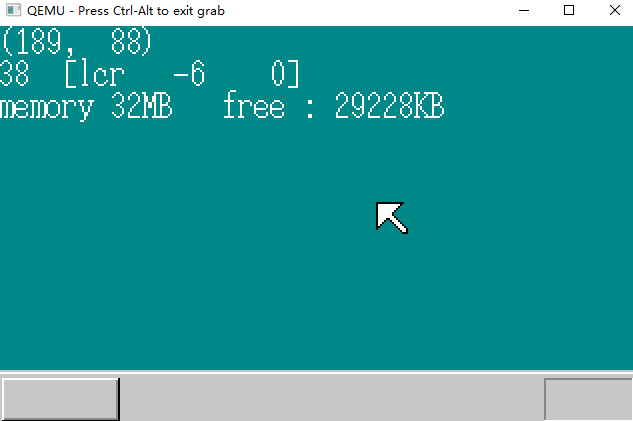

# 叠加处理

## 1.内存管理（续）

将bootpack.c整理内存管理部分到memory.c中了。

因为memman_alloc和memman_free能够以1字节为单位进行内存管理，但容易产生很多不连续的小段未使用空间，所以我们写了一些以0x1000 字节  4KB 为单位进行内存分配和释放的函数，他们会把指定的内存大小按0x1000字节为单位向上舍入 **round up** 。

```C
unsigned int memman_alloc_4k(struct MEMMAN *man, unsigned int size)
{
	unsigned int a;
	size = (size + 0xfff) & 0xfffff000;   	 // 向上舍入
	a = memman_alloc(man, size);		 	// 	
	return a;
}
int memman_free_4k(struct MEMMAN *man, unsigned int addr, unsigned int size)
{
	int i;
	size = (size + 0xfff) & 0xfffff000;  	 // 向上舍入
	i = memman_free(man, addr, size);		 
	return i;
}
```

## 2.叠加处理

窗口的叠加

```C
struct SHEET{ // 透明图层
    unsigned char *buf;  	// 记录图层上所描画内容的地址
    int bxsize, bysize,   	// size
    vx0, vy0, 			   // 坐标
    col_inv, height, flags; // 透明色色号、图层高度、图层的设定信息
};  				// 32 B 指针-4 BYTE 7-INT
```

```C
#define MAX_SHEETS 256
struct SHTCTL{   					    	// sheet control 图层管理
    unsigned char * vram;					// VRAM地址
    int xsize, ysize, top;					// 画面大小、上面图层的高度
    struct SHEET * sheets[MAX_SHEETS];		 // sheets0结构体用于存放SHEET
    struct SHEET sheets0[MAX_SHEETS];		 // sheets 是记忆地址变量的领域
    									 // 将sheets0按高度写入sheets
} 				// 256 * 32 B = 8 KB	
				// 256 *  4 B = 1 KB
				// 9 KB + 16 B = 1024 * 9 + 16 = 9232 B
```

这个结构体需要大于9KB的空间，利用 memman_alloc_4k 分配内存空间。

```C
struct SHTCTL *shtctl_init(struct MEMMAN *memman, unsigned char *vram, int xsize, int ysize)
{
	struct SHTCTL *ctl;
	int i;
	ctl = (struct SHTCTL *) memman_alloc_4k(memman, sizeof (struct SHTCTL));
	if (ctl == 0) {
		goto err;
	}
	ctl->vram = vram;
	ctl->xsize = xsize;
	ctl->ysize = ysize;
	ctl->top = -1; 							/* 一个都没有  */
	for (i = 0; i < MAX_SHEETS; i++) {
		ctl->sheets0[i].flags = 0; 			 /* 标记为未使用 */
	}
err:
	return ctl;
}
#define SHEET_USE		1
struct SHEET *sheet_alloc(struct SHTCTL *ctl)
{
	struct SHEET *sht;
	int i;
	for (i = 0; i < MAX_SHEETS; i++) {
		if (ctl->sheets0[i].flags == 0) {
			sht = &ctl->sheets0[i];
			sht->flags = SHEET_USE; 	/* 使用中 */
			sht->height = -1; 			/* 隐藏 */
			return sht;
		}
	}
	return 0;	/* 没有多的空间 */
}
void sheet_setbuf(struct SHEET *sht, unsigned char *buf, int xsize, int ysize, int col_inv)
{
	sht->buf = buf;
	sht->bxsize = xsize;
	sht->bysize = ysize;
	sht->col_inv = col_inv;
	return;
}
void sheet_updown(struct SHTCTL *ctl, struct SHEET *sht, int height)
{
	int h, old = sht->height; /* 存储设置前的高度信息 */
	/* 如果指定的高度过高或过低、则进行修正 */
	if (height > ctl->top + 1) {
		height = ctl->top + 1;
	}
	if (height < -1) {
		height = -1;
	}
	sht->height = height; /* 高度设定 */
	/* 下面进行sheets[]的重新排列 */
	if (old > height) {	/* 比以前低 */
		if (height >= 0) {
			/* 显示的情况 */
			for (h = old; h > height; h--) {
				ctl->sheets[h] = ctl->sheets[h - 1]; //后移，整个是增续
				ctl->sheets[h]->height = h;
			}
			ctl->sheets[height] = sht;
		} else {	/* 隐藏的情况 */
			if (ctl->top > old) {
				/* 上になっているものをおろす */
				for (h = old; h < ctl->top; h++) {
					ctl->sheets[h] = ctl->sheets[h + 1]; // 前移
					ctl->sheets[h]->height = h;
				}
			}
			ctl->top--; /* 由于显示的图层减少一个，总top-- */
		}
		sheet_refresh(ctl); /* 按新的ctl重新绘制画面 */
	} else if (old < height) {	/* 比以前高 */
		if (old >= 0) {
			/* 以前显示 */
			for (h = old; h < height; h++) {
				ctl->sheets[h] = ctl->sheets[h + 1]; // 前移
				ctl->sheets[h]->height = h;
			}
			ctl->sheets[height] = sht;
		} else {	/* 以前隐藏 */
			/* 把上面的降下来 */
			for (h = ctl->top; h >= height; h--) {
				ctl->sheets[h + 1] = ctl->sheets[h];  	// 后移
				ctl->sheets[h + 1]->height = h + 1;		
			}
			ctl->sheets[height] = sht;
			ctl->top++; /* 显示的图层增加 top++  */
		}
		sheet_refresh(ctl); /* 重新绘制画面 */
	}
	return;
}
void sheet_refresh(struct SHTCTL *ctl)
{
	int h, bx, by, vx, vy;
	unsigned char *buf, c, *vram = ctl->vram;
	struct SHEET *sht;
	for (h = 0; h <= ctl->top; h++) {
		sht = ctl->sheets[h];
		buf = sht->buf;
		for (by = 0; by < sht->bysize; by++) {
			vy = sht->vy0 + by;
			for (bx = 0; bx < sht->bxsize; bx++) {
				vx = sht->vx0 + bx;
				c = buf[by * sht->bxsize + bx];
				if (c != sht->col_inv) { // 当他为透明色时，不更新此像素点
					vram[vy * ctl->xsize + vx] = c;
				}
			}
		}
	}
	return;
}
void sheet_slide(struct SHTCTL *ctl, struct SHEET *sht, int vx0, int vy0) // 上下左右移动
{
	sht->vx0 = vx0;
	sht->vy0 = vy0;
	if (sht->height >= 0) { /* 界面正在显示 */
		sheet_refresh(ctl); /* 重新绘制图像 */
	}
	return;
}
void sheet_free(struct SHTCTL *ctl, struct SHEET *sht) 			// 释放图层
{
	if (sht->height >= 0) {
		sheet_updown(ctl, sht, -1); /* 如果处于显示状态，则先设定为隐藏 */
	}
	sht->flags = 0; /* "未使用"标志 */
	return;
}
```

```C
void HariMain(void)
{
	struct SHTCTL *shtctl;
	struct SHEET *sht_back, *sht_mouse;
	unsigned char *buf_back, buf_mouse[256];
	init_palette();
	shtctl = shtctl_init(memman, binfo->vram, binfo->scrnx, binfo->scrny);
	sht_back  = sheet_alloc(shtctl);
	sht_mouse = sheet_alloc(shtctl);
	buf_back  = (unsigned char *) memman_alloc_4k(memman, binfo->scrnx * binfo->scrny);
	sheet_setbuf(sht_back, buf_back, binfo->scrnx, binfo->scrny, -1); /* 没有透明色 */
	sheet_setbuf(sht_mouse, buf_mouse, 16, 16, 99); 				// 透明色号 99
	init_screen8(buf_back, binfo->scrnx, binfo->scrny);
	init_mouse_cursor8(buf_mouse, 99);	// 背景色号 99
	sheet_slide(shtctl, sht_back, 0, 0);
	mx = (binfo->scrnx - 16) / 2; 								   /* 按显示在画面中央来计算坐标 */
	my = (binfo->scrny - 28 - 16) / 2;
	sheet_slide(shtctl, sht_mouse, mx, my);
	sheet_updown(shtctl, sht_back,  0);
	sheet_updown(shtctl, sht_mouse, 1);
	sprintf(s, "(%3d, %3d)", mx, my);								// 这些数据都存在 buf_back 中了
	putfonts8_asc(buf_back, binfo->scrnx, 0, 0, COL8_FFFFFF, s);
	sprintf(s, "memory %dMB   free : %dKB",
			memtotal / (1024 * 1024), memman_total(memman) / 1024);
	putfonts8_asc(buf_back, binfo->scrnx, 0, 32, COL8_FFFFFF, s);
	sheet_refresh(shtctl);

	for (;;) {
		io_cli();
		if (fifo8_status(&keyfifo) + fifo8_status(&mousefifo) == 0) {
			io_stihlt();
		} else {
			if (fifo8_status(&keyfifo) != 0) {
				i = fifo8_get(&keyfifo);
				io_sti();
				sprintf(s, "%02X", i);
				boxfill8(buf_back, binfo->scrnx, COL8_008484,  0, 16, 15, 31);
				putfonts8_asc(buf_back, binfo->scrnx, 0, 16, COL8_FFFFFF, s);
				sheet_refresh(shtctl);
			} else if (fifo8_status(&mousefifo) != 0) {
				i = fifo8_get(&mousefifo);
				io_sti();
				if (mouse_decode(&mdec, i) != 0) {
					/* 因为已得到3BYTE的数据所以显示 */
					sprintf(s, "[lcr %4d %4d]", mdec.x, mdec.y);
					if ((mdec.btn & 0x01) != 0) {
						s[1] = 'L';
					}
					if ((mdec.btn & 0x02) != 0) {
						s[3] = 'R';
					}
					if ((mdec.btn & 0x04) != 0) {
						s[2] = 'C';
					}
                      		// 将显示文字的部分背景覆盖，重新显示文字。
					boxfill8(buf_back, binfo->scrnx, COL8_008484, 32, 16, 32 + 15 * 8 - 1, 31);
					putfonts8_asc(buf_back, binfo->scrnx, 32, 16, COL8_FFFFFF, s);
					/* 鼠标移动 */
					mx += mdec.x;
					my += mdec.y;
					if (mx < 0) {
						mx = 0;
					}
					if (my < 0) {
						my = 0;
					}
					if (mx > binfo->scrnx - 16) {
						mx = binfo->scrnx - 16;
					}
					if (my > binfo->scrny - 16) {
						my = binfo->scrny - 16;
					}
					sprintf(s, "(%3d, %3d)", mx, my);
					boxfill8(buf_back, binfo->scrnx, COL8_008484, 0, 0, 79, 15); /* 消坐标 */
					putfonts8_asc(buf_back, binfo->scrnx, 0, 0, COL8_FFFFFF, s); /* 写坐标く */
					sheet_slide(shtctl, sht_mouse, mx, my); /* 鼠标窗口的滑动 */
				}
			}
		}
	}
}
```



## 3.提高叠加处理速度（1）

在调用sheet_slide() 函数时，会对整个界面进行刷新 320 * 200 = 64000 个像素，但实际上只有鼠标在移动。

```C
void sheet_refreshsub(struct SHTCTL *ctl, int vx0, int vy0, int vx1, int vy1)
{
	int h, bx, by, vx, vy;
	unsigned char *buf, c, *vram = ctl->vram;
	struct SHEET *sht;
	for (h = 0; h <= ctl->top; h++) {
		sht = ctl->sheets[h];
		buf = sht->buf;
		for (by = 0; by < sht->bysize; by++) {
			vy = sht->vy0 + by;
			for (bx = 0; bx < sht->bxsize; bx++) {
				vx = sht->vx0 + bx;
				if (vx0 <= vx && vx < vx1 && vy0 <= vy && vy < vy1) {
					c = buf[by * sht->bxsize + bx];
					if (c != sht->col_inv) {
						vram[vy * ctl->xsize + vx] = c;
					}
				}
			}
		}
	}
	return;
}
```

检索每个图层在那一个方块的像素，指定了刷新的范围。

```C
void sheet_slide(struct SHTCTL *ctl, struct SHEET *sht, int vx0, int vy0)
{
	int old_vx0 = sht->vx0, old_vy0 = sht->vy0;
	sht->vx0 = vx0;
	sht->vy0 = vy0;
	if (sht->height >= 0) { /* 如果正在显示，则按新图层的信息刷新画面 */
        // 刷新两个块
		sheet_refreshsub(ctl, old_vx0, old_vy0, old_vx0 + sht->bxsize, old_vy0 + sht->bysize);
		sheet_refreshsub(ctl, vx0, vy0, vx0 + sht->bxsize, vy0 + sht->bysize);
	}
	return;
}
```

当移动鼠标时，**文字**更新的问题

```C
void sheet_refresh(struct SHTCTL *ctl, struct SHEET *sht, int bx0, int by0, int bx1, int by1)
{
	if (sht->height >= 0) { /* 如果正在显示，则按新图层的信息刷新 */
		sheet_refreshsub(ctl, sht->vx0 + bx0, sht->vy0 + by0, sht->vx0 + bx1, sht->vy0 + by1);
	}
	return;
}
```

指定范围，并不是直接指定画面内的坐标，二十以缓冲区内的坐标来表示。HariMain就可以不考虑图层在画面中的位置了。

修改sheet_updown()、HariMain() :

```C
void HariMain(void)
{
    //-----------------------
	sprintf(s, "(%3d, %3d)", mx, my);
	putfonts8_asc(buf_back, binfo->scrnx, 0, 0, COL8_FFFFFF, s);
	sprintf(s, "memory %dMB   free : %dKB",
			memtotal / (1024 * 1024), memman_total(memman) / 1024);
	putfonts8_asc(buf_back, binfo->scrnx, 0, 32, COL8_FFFFFF, s);
	sheet_refresh(shtctl, sht_back, 0, 0, binfo->scrnx, 48);
	for (;;) {
		io_cli();
		if (fifo8_status(&keyfifo) + fifo8_status(&mousefifo) == 0) {
			io_stihlt();
		} else {
			if (fifo8_status(&keyfifo) != 0) {
				sheet_refresh(shtctl, sht_back, 0, 16, 16, 32);
			} else if (fifo8_status(&mousefifo) != 0) {
				i = fifo8_get(&mousefifo);
				io_sti();
				if (mouse_decode(&mdec, i) != 0) {
                    // --------------------------------
					boxfill8(buf_back, binfo->scrnx, COL8_008484, 32, 16, 32 + 15 * 8 - 1, 31);
					putfonts8_asc(buf_back, binfo->scrnx, 32, 16, COL8_FFFFFF, s);
					sheet_refresh(shtctl, sht_back, 32, 16, 32 + 15 * 8, 32);
                    // --------------------------------
					sprintf(s, "(%3d, %3d)", mx, my);
					boxfill8(buf_back, binfo->scrnx, COL8_008484, 0, 0, 79, 15); /* 座標消す */
					putfonts8_asc(buf_back, binfo->scrnx, 0, 0, COL8_FFFFFF, s); /* 座標書く */
					sheet_refresh(shtctl, sht_back, 0, 0, 80, 16);
					sheet_slide(shtctl, sht_mouse, mx, my);
				}
			}
		}
	}
}
```


## 4.提高叠加处理速度（2）

还是没有达到我们的期望，修改refreshsub :

```C
void sheet_refreshsub(struct SHTCTL *ctl, int vx0, int vy0, int vx1, int vy1)
{
	int h, bx, by, vx, vy, bx0, by0, bx1, by1;
	unsigned char *buf, c, *vram = ctl->vram;
	struct SHEET *sht;
	for (h = 0; h <= ctl->top; h++) {
		sht = ctl->sheets[h];
		buf = sht->buf;
		/* 使用vx0~vy1，对bx0~by1进行倒推 */
		bx0 = vx0 - sht->vx0;
		by0 = vy0 - sht->vy0;
		bx1 = vx1 - sht->vx0;
		by1 = vy1 - sht->vy0;
		if (bx0 < 0) { bx0 = 0; }
		if (by0 < 0) { by0 = 0; }
		if (bx1 > sht->bxsize) { bx1 = sht->bxsize; }
		if (by1 > sht->bysize) { by1 = sht->bysize; }
		for (by = by0; by < by1; by++) {
			vy = sht->vy0 + by;
			for (bx = bx0; bx < bx1; bx++) {
				vx = sht->vx0 + bx;
				c = buf[by * sht->bxsize + bx];
				if (c != sht->col_inv) {
					vram[vy * ctl->xsize + vx] = c;
				}
			}
		}
	}
	return;
}
```

将从 0 ~ bxsize 之间循环，变成了 bx0 ~ bx1 之间循环。

.PNG)

day 10 FINISH

TAKR