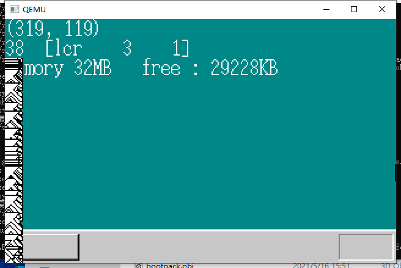
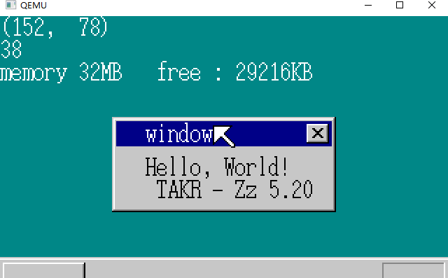
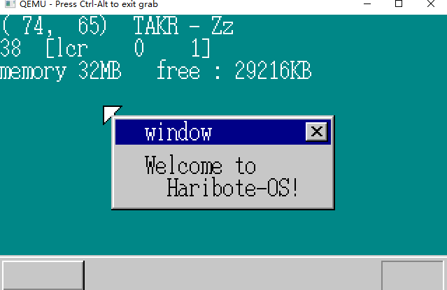
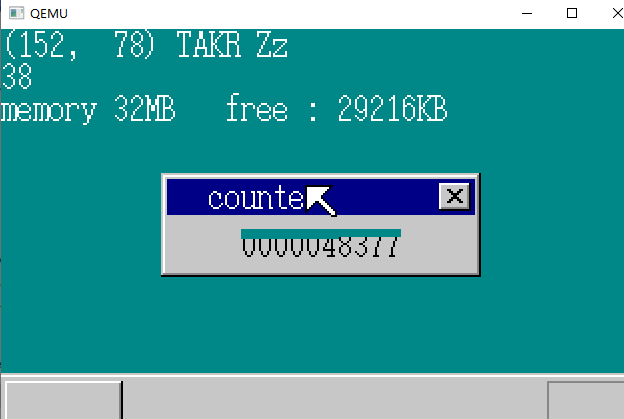
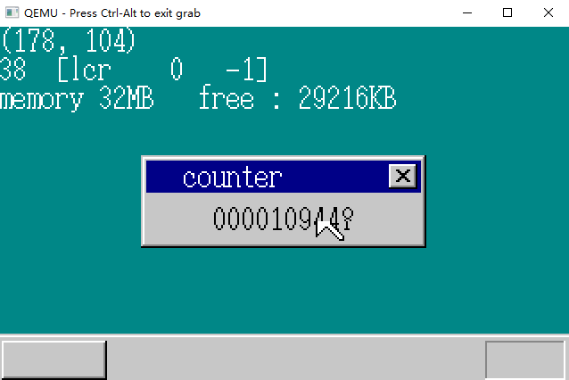
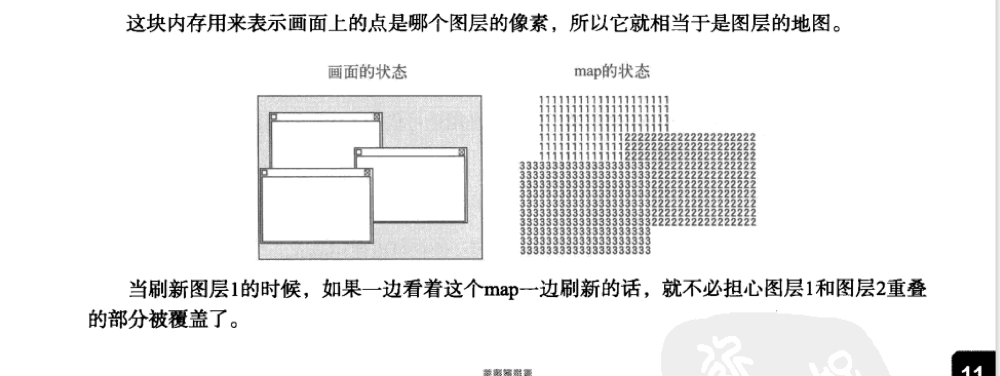
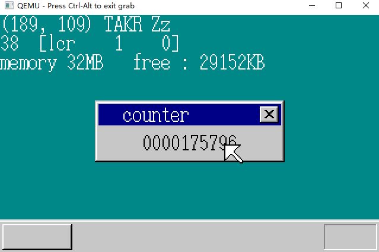

# 制作窗口

## 1.鼠标显示问题

将鼠标的移动范围扩大

```C
if (mx > binfo->scrnx - 1) {
    mx = binfo->scrnx - 1;
}
if (my > binfo->scrny - 1) {
    my = binfo->scrny - 1;
}
```



## 2.实现画面外的支持

让 sheet_refreshsub() 做的更完美一些 ：

```C
void sheet_refreshsub(struct SHTCTL *ctl, int vx0, int vy0, int vx1, int vy1)
{
	int h, bx, by, vx, vy, bx0, by0, bx1, by1;
	unsigned char *buf, c, *vram = ctl->vram;
	struct SHEET *sht;
	/* 如果refresh的范围超出了画面则修正 */
	if (vx0 < 0) { vx0 = 0; }
	if (vy0 < 0) { vy0 = 0; }
	if (vx1 > ctl->xsize) { vx1 = ctl->xsize; }
	if (vy1 > ctl->ysize) { vy1 = ctl->ysize; }
	//---------------------------------
	return;
}
```

在显示窗口时不会跨越边界显示。

## 3.shtctl的指定省略

在SHEET中增加SHTCTL的指针 找到它的父亲，可以减少函数参数的输入。 *（ what for ？）*

```C
struct SHEET{
    unsigned char * buf;
    int bxsize, bysize, vx0, vy0, col_inv, height, flags;
    struct SHTCTL *ctl;
}
```

```C
struct SHTCTL *shtctl_init(struct MEMMAN *memman, unsigned char *vram, int xsize, int ysize)
{
	struct SHTCTL *ctl;
	int i;
	ctl = (struct SHTCTL *) memman_alloc_4k(memman, sizeof (struct SHTCTL));
	if (ctl == 0) {
		goto err;
	}
	ctl->vram = vram;
	ctl->xsize = xsize;
	ctl->ysize = ysize;
	ctl->top = -1; /* 没有SHEET */
     // 属性赋值
	for (i = 0; i < MAX_SHEETS; i++) {
		ctl->sheets0[i].flags = 0; /* 未使用的标记 */
		ctl->sheets0[i].ctl = ctl; /* = this */
	}
err:
	return ctl;
}
```

```C
void sheet_updown(struct SHEET *sht, int height)
{
	struct SHTCTL *ctl = sht->ctl;
	int h, old = sht->height; /* 設定前の高さを記憶する */
	//-------------------------------
}
```

bootpack.h :

```C
struct SHTCTL *shtctl_init(struct MEMMAN *memman, unsigned char *vram, int xsize, int ysize);
struct SHEET *sheet_alloc(struct SHTCTL *ctl);
void sheet_setbuf(struct SHEET *sht, unsigned char *buf, int xsize, int ysize, int col_inv);
void sheet_updown(struct SHEET *sht, int height);
void sheet_refresh(struct SHEET *sht, int bx0, int by0, int bx1, int by1);
void sheet_slide(struct SHEET *sht, int vx0, int vy0);
void sheet_free(struct SHEET *sht);
```

## 4.显示窗口

**制作窗口：**

+ 准备图层
+ 在图层中绘制窗口的外形

make_window8() :

```C
void make_window8(unsigned char *buf, int xsize, int ysize, char *title)
{
	static char closebtn[14][16] = {
		"OOOOOOOOOOOOOOO@",
		"OQQQQQQQQQQQQQ$@",
		"OQQQQQQQQQQQQQ$@",
		"OQQQ@@QQQQ@@QQ$@",
		"OQQQQ@@QQ@@QQQ$@",
		"OQQQQQ@@@@QQQQ$@",
		"OQQQQQQ@@QQQQQ$@",
		"OQQQQQ@@@@QQQQ$@",
		"OQQQQ@@QQ@@QQQ$@",
		"OQQQ@@QQQQ@@QQ$@",
		"OQQQQQQQQQQQQQ$@",
		"OQQQQQQQQQQQQQ$@",
		"O$$$$$$$$$$$$$$@",
		"@@@@@@@@@@@@@@@@"
	};
	int x, y;
	char c;
    // 绘制外形
	boxfill8(buf, xsize, COL8_C6C6C6, 0,         0,         xsize - 1, 0        );
	boxfill8(buf, xsize, COL8_FFFFFF, 1,         1,         xsize - 2, 1        );
	boxfill8(buf, xsize, COL8_C6C6C6, 0,         0,         0,         ysize - 1);
	boxfill8(buf, xsize, COL8_FFFFFF, 1,         1,         1,         ysize - 2);
	boxfill8(buf, xsize, COL8_848484, xsize - 2, 1,         xsize - 2, ysize - 2);
	boxfill8(buf, xsize, COL8_000000, xsize - 1, 0,         xsize - 1, ysize - 1);
	boxfill8(buf, xsize, COL8_C6C6C6, 2,         2,         xsize - 3, ysize - 3);
	boxfill8(buf, xsize, COL8_000084, 3,         3,         xsize - 4, 20       );
	boxfill8(buf, xsize, COL8_848484, 1,         ysize - 2, xsize - 2, ysize - 2);
	boxfill8(buf, xsize, COL8_000000, 0,         ysize - 1, xsize - 1, ysize - 1);
	putfonts8_asc(buf, xsize, 24, 4, COL8_FFFFFF, title);
    		// 显示title
    // 显示 X button
	for (y = 0; y < 14; y++) {
		for (x = 0; x < 16; x++) {
			c = closebtn[y][x];
			if (c == '@') {
				c = COL8_000000;
			} else if (c == '$') {
				c = COL8_848484;
			} else if (c == 'Q') {
				c = COL8_C6C6C6;
			} else {
				c = COL8_FFFFFF;
			}
			buf[(5 + y) * xsize + (xsize - 21 + x)] = c;
		}
	}
	return;
}
```

```C
void HariMain(void)
{
	struct SHTCTL *shtctl;
	struct SHEET *sht_back, *sht_mouse, *sht_win;
	unsigned char *buf_back, buf_mouse[256], *buf_win;
	init_palette();
	shtctl = shtctl_init(memman, binfo->vram, binfo->scrnx, binfo->scrny);
	sht_back  = sheet_alloc(shtctl);
	sht_mouse = sheet_alloc(shtctl);
	sht_win   = sheet_alloc(shtctl);
	buf_back  = (unsigned char *) memman_alloc_4k(memman, binfo->scrnx * binfo->scrny);
	buf_win   = (unsigned char *) memman_alloc_4k(memman, 160 * 68);
	sheet_setbuf(sht_back, buf_back, binfo->scrnx, binfo->scrny, -1); /* 没有透明色 */
	sheet_setbuf(sht_mouse, buf_mouse, 16, 16, 99);
	sheet_setbuf(sht_win, buf_win, 160, 68, -1); /* 没有透明色 */
	init_screen8(buf_back, binfo->scrnx, binfo->scrny);
	init_mouse_cursor8(buf_mouse, 99);
	make_window8(buf_win, 160, 68, "window");
    // !!!!!!!!!!!!!!!!!!!!!!!!!!!!!!!!!!!!!!!!!!!!!!!!!!!!!!!!
	putfonts8_asc(buf_win, 160, 24, 28, COL8_000000, "Welcome to");
	putfonts8_asc(buf_win, 160, 24, 44, COL8_000000, "  Haribote-OS!");
	sheet_slide(sht_back, 0, 0);
	mx = (binfo->scrnx - 16) / 2; /* 画面中央になるように座標計算 */
	my = (binfo->scrny - 28 - 16) / 2;
	sheet_slide(sht_mouse, mx, my);
	sheet_slide(sht_win, 80, 72);
	sheet_updown(sht_back,  0);
	sheet_updown(sht_win,   1);
	sheet_updown(sht_mouse, 2);
	sprintf(s, "(%3d, %3d)", mx, my);
	putfonts8_asc(buf_back, binfo->scrnx, 0, 0, COL8_FFFFFF, s);
	sprintf(s, "memory %dMB   free : %dKB",
			memtotal / (1024 * 1024), memman_total(memman) / 1024);
	putfonts8_asc(buf_back, binfo->scrnx, 0, 32, COL8_FFFFFF, s);
	sheet_refresh(sht_back, 0, 0, binfo->scrnx, 48);
//------------------------------------------
}
```



## 5.小实验

在设置高度时，将 背景设为0， 鼠标设为1， 背景设为2。



## 6.高速计数器

制作一个能够计数，并显示计数结果的窗口： （counter）

```C
void HariMain(void)
{
	struct BOOTINFO *binfo = (struct BOOTINFO *) ADR_BOOTINFO;
	char s[40], keybuf[32], mousebuf[128];
	int mx, my, i;
	unsigned int memtotal, count = 0; // !!!!!!
	struct MOUSE_DEC mdec;
	struct MEMMAN *memman = (struct MEMMAN *) MEMMAN_ADDR;
	struct SHTCTL *shtctl;
	struct SHEET *sht_back, *sht_mouse, *sht_win;
	unsigned char *buf_back, buf_mouse[256], *buf_win;
//------------------------------------------------------
	init_palette();
	shtctl = shtctl_init(memman, binfo->vram, binfo->scrnx, binfo->scrny);
	sht_back  = sheet_alloc(shtctl);
	sht_mouse = sheet_alloc(shtctl);
	sht_win   = sheet_alloc(shtctl);
	buf_back  = (unsigned char *) memman_alloc_4k(memman, binfo->scrnx * binfo->scrny);
	buf_win   = (unsigned char *) memman_alloc_4k(memman, 160 * 52);
	sheet_setbuf(sht_back, buf_back, binfo->scrnx, binfo->scrny, -1); /* 透明色なし */
	sheet_setbuf(sht_mouse, buf_mouse, 16, 16, 99);
	sheet_setbuf(sht_win, buf_win, 160, 52, -1); /* 透明色なし */
	init_screen8(buf_back, binfo->scrnx, binfo->scrny);
	init_mouse_cursor8(buf_mouse, 99);
    // buf_win !!
	make_window8(buf_win, 160, 52, "counter");// title 为 counter
	sheet_slide(sht_back, 0, 0);
	mx = (binfo->scrnx - 16) / 2; /* 画面中央になるように座標計算 */
	my = (binfo->scrny - 28 - 16) / 2;
	sheet_slide(sht_mouse, mx, my);
	sheet_slide(sht_win, 80, 72);
	sheet_updown(sht_back,  0);
	sheet_updown(sht_win,   1);
	sheet_updown(sht_mouse, 2);
	sprintf(s, "(%3d, %3d) TAKR - Zz ", mx, my);
	putfonts8_asc(buf_back, binfo->scrnx, 0, 0, COL8_FFFFFF, s);
	sprintf(s, "memory %dMB   free : %dKB",
			memtotal / (1024 * 1024), memman_total(memman) / 1024);
	putfonts8_asc(buf_back, binfo->scrnx, 0, 32, COL8_FFFFFF, s);
	sheet_refresh(sht_back, 0, 0, binfo->scrnx, 48);
 //  -----------------------------------------------------------
    for (;;) {
		count++;
		sprintf(s, "%010d", count);
		boxfill8(buf_win, 160, COL8_C6C6C6, 40, 28, 119, 43);
		putfonts8_asc(buf_win, 160, 40, 28, COL8_000000, s);
		sheet_refresh(sht_win, 40, 28, 120, 44);

		io_cli();
		if (fifo8_status(&keyfifo) + fifo8_status(&mousefifo) == 0) {
			io_sti();
		} else {}
    }
    
}
```



会出现闪烁，这是因为在刷新时，总是先刷新refresh范围内的背景图层，然后再刷新窗口图层，所以肯定就会闪烁了。（ 只刷新最高层？）

## 7.消除闪烁（1）

图层刷新可以认为其他图层的内容没有变化，只更新refresh对象及其以上的图层就可以了。

```C
void sheet_refreshsub(struct SHTCTL *ctl, int vx0, int vy0, int vx1, int vy1, int h0)
{
	int h, bx, by, vx, vy, bx0, by0, bx1, by1;
	unsigned char *buf, c, *vram = ctl->vram;
	struct SHEET *sht;
	/* refresh範囲が画面外にはみ出していたら補正 */
	if (vx0 < 0) { vx0 = 0; }
	if (vy0 < 0) { vy0 = 0; }
	if (vx1 > ctl->xsize) { vx1 = ctl->xsize; }
	if (vy1 > ctl->ysize) { vy1 = ctl->ysize; }
	for (h = h0; h <= ctl->top; h++) { // 从当前height开始向上
		sht = ctl->sheets[h];
		buf = sht->buf;
		/* vx0～vy1を使って、bx0～by1を逆算する */
		bx0 = vx0 - sht->vx0;
		by0 = vy0 - sht->vy0;
		bx1 = vx1 - sht->vx0;
		by1 = vy1 - sht->vy0;
		if (bx0 < 0) { bx0 = 0; }
		if (by0 < 0) { by0 = 0; }
		if (bx1 > sht->bxsize) { bx1 = sht->bxsize; }
		if (by1 > sht->bysize) { by1 = sht->bysize; }
		for (by = by0; by < by1; by++) {
			vy = sht->vy0 + by;
			for (bx = bx0; bx < bx1; bx++) {
				vx = sht->vx0 + bx;
				c = buf[by * sht->bxsize + bx];
				if (c != sht->col_inv) {
					vram[vy * ctl->xsize + vx] = c;
				}
			}
		}
	}
	return;
}
```

```C
void sheet_refresh(struct SHEET *sht, int bx0, int by0, int bx1, int by1)
{
	if (sht->height >= 0) { /* 正在显示，则按照新图层的信息进行刷新 */
		sheet_refreshsub(sht->ctl, sht->vx0 + bx0, sht->vy0 + by0, sht->vx0 + bx1, sht->vy0 + by1, sht->height); // height 参数
	}
	return;
}
```

```C
void sheet_updown(struct SHEET *sht, int height)
{
	struct SHTCTL *ctl = sht->ctl;
	int h, old = sht->height; /* 設定前の高さを記憶する */
	/* 指定が低すぎや高すぎだったら、修正する */
	if (height > ctl->top + 1) {
		height = ctl->top + 1;
	}
	if (height < -1) {
		height = -1;
	}
	sht->height = height; /* 高さを設定 */
	/* 以下は主にsheets[]の並べ替え */
	if (old > height) {	/* 以前よりも低くなる */
		if (height >= 0) {
			/* 間のものを引き上げる */
			for (h = old; h > height; h--) {
				ctl->sheets[h] = ctl->sheets[h - 1];
				ctl->sheets[h]->height = h;
			}
			ctl->sheets[height] = sht;
			sheet_refreshsub(ctl, sht->vx0, sht->vy0, sht->vx0 + sht->bxsize, sht->vy0 + sht->bysize, height + 1);
		} else {	/* 非表示化 */
			if (ctl->top > old) {
				/* 上になっているものをおろす */
				for (h = old; h < ctl->top; h++) {
					ctl->sheets[h] = ctl->sheets[h + 1];
					ctl->sheets[h]->height = h;
				}
			}
			ctl->top--; /* 表示中の下じきが一つ減るので、一番上の高さが減る */
			sheet_refreshsub(ctl, sht->vx0, sht->vy0, sht->vx0 + sht->bxsize, sht->vy0 + sht->bysize, 0);
		}
	} else if (old < height) {	/* 以前よりも高くなる */
		if (old >= 0) {
			/* 間のものを押し下げる */
			for (h = old; h < height; h++) {
				ctl->sheets[h] = ctl->sheets[h + 1];
				ctl->sheets[h]->height = h;
			}
			ctl->sheets[height] = sht;
		} else {	/* 非表示状態から表示状態へ */
			/* 上になるものを持ち上げる */
			for (h = ctl->top; h >= height; h--) {
				ctl->sheets[h + 1] = ctl->sheets[h];
				ctl->sheets[h + 1]->height = h + 1;
			}
			ctl->sheets[height] = sht;
			ctl->top++; /* 表示中の下じきが一つ増えるので、一番上の高さが増える */
		}
		sheet_refreshsub(ctl, sht->vx0, sht->vy0, sht->vx0 + sht->bxsize, sht->vy0 + sht->bysize, height);
	}
	return;
}
```

```C
void sheet_slide(struct SHEET *sht, int vx0, int vy0)
{
	int old_vx0 = sht->vx0, old_vy0 = sht->vy0;
	sht->vx0 = vx0;
	sht->vy0 = vy0;
	if (sht->height >= 0) { /* もしも表示中なら、新しい下じきの情報に沿って画面を描き直す */
		sheet_refreshsub(sht->ctl, old_vx0, old_vy0, old_vx0 + sht->bxsize, old_vy0 + sht->bysize, 0);
		sheet_refreshsub(sht->ctl, vx0, vy0, vx0 + sht->bxsize, vy0 + sht->bysize, sht->height);
	}
	return;
}
```

在slide函数中，图层的移动会导致下层的露出，所以要从最下面开始刷新。另一方面，在移动处，比新来的图层要低的图层没有变化，只是隐藏起来。



## 8.消除闪烁（2）

当鼠标在counter数字上时，会出现闪烁现象，需要在刷新时避开鼠标所在的地方对VRAM进行写入处理。

先开辟一块新内存，大小和VRAM一样，称为map。

```C
struct SHTCTL {
    unsigned char *vram, *map;
    int xsize, ysize, top;
    struct SHEET *sheets[MAX_SHEETS];
    struct SHEET sheets0[MAX_SHEETS];
}

struct SHTCTL *shtctl_init(struct MEMMAN *memman, unsigned char *vram, int xsize, int ysize){
    struct SHTCTL *ctl;
    int i;
    ctl = (struct SHTCTL *) memman_alloc_4k(memman, sizeof (struct SHTCTL));
    if(ctl == 0){
        goto err;
    }
    ctl->map = (unsigned char *) memman_alloc_4k(memman, xsize * ysize);
    if(ctl->map == 0){
        memman_free_4k(memman, (int)ctl, sizeof(struct SHTCTL));
        goto err;
    }
    ctl->vram = vram;
    ctl->xsize = xsize;
    ctl->ysize = ysize;
    ctl->top = -1;
    for(i = 0;i<MAX_SHEETS; i++){
        ctl->sheets0[i].flags = 0;
        ctl->sheets0[i].ctl = ctl;
    }
err:
    return ctl;
}
```

map的大小是 xsize * ysize，



```C
void sheet_refreshmap(struct SHTCTL *ctl, int vx0, int vy0, int vx1, int vy1, int h0)
{
	int h, bx, by, vx, vy, bx0, by0, bx1, by1;
	unsigned char *buf, sid, *map = ctl->map;
	struct SHEET *sht;
    // 坐标修正
	if (vx0 < 0) { vx0 = 0; }
	if (vy0 < 0) { vy0 = 0; }
	if (vx1 > ctl->xsize) { vx1 = ctl->xsize; }
	if (vy1 > ctl->ysize) { vy1 = ctl->ysize; }
    
	for (h = h0; h <= ctl->top; h++) {
		sht = ctl->sheets[h];
		sid = sht - ctl->sheets0; /* 将进行了减法计算的地址作为图层号码使用 蕴含高度信息*/
		buf = sht->buf;
        // 得到vx vy 在sht中的相对坐标
		bx0 = vx0 - sht->vx0;
		by0 = vy0 - sht->vy0;
		bx1 = vx1 - sht->vx0;
		by1 = vy1 - sht->vy0;
        // 坐标修正
		if (bx0 < 0) { bx0 = 0; }
		if (by0 < 0) { by0 = 0; }
		if (bx1 > sht->bxsize) { bx1 = sht->bxsize; }
		if (by1 > sht->bysize) { by1 = sht->bysize; }
        
		for (by = by0; by < by1; by++) {
			vy = sht->vy0 + by;
			for (bx = bx0; bx < bx1; bx++) {
				vx = sht->vx0 + bx;
				if (buf[by * sht->bxsize + bx] != sht->col_inv) {
					map[vy * ctl->xsize + vx] = sid; // sid SHEET ID
				}
			}
		}
	}
	return;
}
```

```C
void sheet_refreshsub(struct SHTCTL *ctl, int vx0, int vy0, int vx1, int vy1, int h0, int h1)
{
	int h, bx, by, vx, vy, bx0, by0, bx1, by1;
	unsigned char *buf, *vram = ctl->vram, *map = ctl->map, sid;
	struct SHEET *sht;
	/* refresh範囲が画面外にはみ出していたら補正 */
	if (vx0 < 0) { vx0 = 0; }
	if (vy0 < 0) { vy0 = 0; }
	if (vx1 > ctl->xsize) { vx1 = ctl->xsize; }
	if (vy1 > ctl->ysize) { vy1 = ctl->ysize; }
	for (h = h0; h <= h1; h++) {
		sht = ctl->sheets[h];
		buf = sht->buf;
		sid = sht - ctl->sheets0;
		/* vx0～vy1を使って、bx0～by1を逆算する */
		bx0 = vx0 - sht->vx0;
		by0 = vy0 - sht->vy0;
		bx1 = vx1 - sht->vx0;
		by1 = vy1 - sht->vy0;
		if (bx0 < 0) { bx0 = 0; }
		if (by0 < 0) { by0 = 0; }
		if (bx1 > sht->bxsize) { bx1 = sht->bxsize; }
		if (by1 > sht->bysize) { by1 = sht->bysize; }
		for (by = by0; by < by1; by++) {
			vy = sht->vy0 + by;
			for (bx = bx0; bx < bx1; bx++) {
				vx = sht->vx0 + bx;
				if (map[vy * ctl->xsize + vx] == sid) {
					vram[vy * ctl->xsize + vx] = buf[by * sht->bxsize + bx];
				}
			}
		}
	}
	return;
}
```

```C
void sheet_refresh(struct SHEET *sht, int bx0, int by0, int bx1, int by1)
{
	if (sht->height >= 0) { /* もしも表示中なら、新しい下じきの情報に沿って画面を描き直す */
		sheet_refreshsub(sht->ctl, sht->vx0 + bx0, sht->vy0 + by0, sht->vx0 + bx1, sht->vy0 + by1, sht->height, sht->height);
	}
	return;
}
```

```C
void sheet_slide(struct SHEET *sht, int vx0, int vy0)
{
	struct SHTCTL *ctl = sht->ctl;
	int old_vx0 = sht->vx0, old_vy0 = sht->vy0;
	sht->vx0 = vx0;
	sht->vy0 = vy0;
	if (sht->height >= 0) { /* もしも表示中なら、新しい下じきの情報に沿って画面を描き直す */
		sheet_refreshmap(ctl, old_vx0, old_vy0, old_vx0 + sht->bxsize, old_vy0 + sht->bysize, 0);
		sheet_refreshmap(ctl, vx0, vy0, vx0 + sht->bxsize, vy0 + sht->bysize, sht->height);
		sheet_refreshsub(ctl, old_vx0, old_vy0, old_vx0 + sht->bxsize, old_vy0 + sht->bysize, 0, sht->height - 1); // 更新height以下所有层
		sheet_refreshsub(ctl, vx0, vy0, vx0 + sht->bxsize, vy0 + sht->bysize, sht->height, sht->height); // 只更新height层
	}
	return;
}
```

```C
void sheet_updown(struct SHEET *sht, int height)
{
    // ----------------------------------------
	/* 下面主要是对sheets[]进行重新排列 */
	if (old > height) {	/* 比以前低 */
		if (height >= 0) {
			/* 中间的图层也提高一层 */
			// ----------------------------------
			sheet_refreshmap(ctl, sht->vx0, sht->vy0, sht->vx0 + sht->bxsize, sht->vy0 + sht->bysize, height + 1);
			sheet_refreshsub(ctl, sht->vx0, sht->vy0, sht->vx0 + sht->bxsize, sht->vy0 + sht->bysize, height + 1, old);
		} else {	/* 非表示化 */
			
			sheet_refreshmap(ctl, sht->vx0, sht->vy0, sht->vx0 + sht->bxsize, sht->vy0 + sht->bysize, 0);
			sheet_refreshsub(ctl, sht->vx0, sht->vy0, sht->vx0 + sht->bxsize, sht->vy0 + sht->bysize, 0, old - 1);
		}
	} else if (old < height) {	/* 以前よりも高くなる */
		if (old >= 0) {
			/* 間のものを押し下げる */
			for (h = old; h < height; h++) {
				ctl->sheets[h] = ctl->sheets[h + 1];
				ctl->sheets[h]->height = h;
			}
			ctl->sheets[height] = sht;
		} else {	/* 非表示状態から表示状態へ */
			/* 上になるものを持ち上げる */
			for (h = ctl->top; h >= height; h--) {
				ctl->sheets[h + 1] = ctl->sheets[h];
				ctl->sheets[h + 1]->height = h + 1;
			}
			ctl->sheets[height] = sht;
			ctl->top++; /* 表示中の下じきが一つ増えるので、一番上の高さが増える */
		}
		sheet_refreshmap(ctl, sht->vx0, sht->vy0, sht->vx0 + sht->bxsize, sht->vy0 + sht->bysize, height);
		sheet_refreshsub(ctl, sht->vx0, sht->vy0, sht->vx0 + sht->bxsize, sht->vy0 + sht->bysize, height, height);
	}
	return;
}
```



day 11 finish   

TAKR - Zz  

2021-05-20 