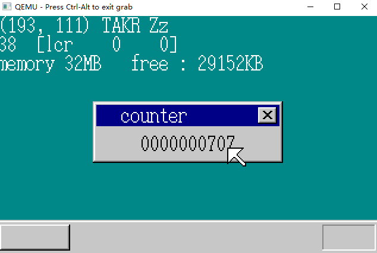
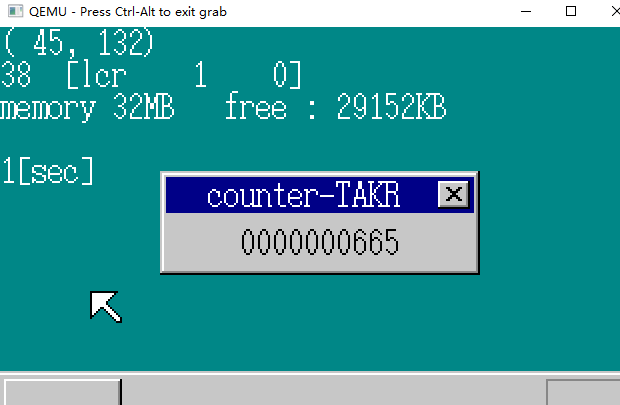
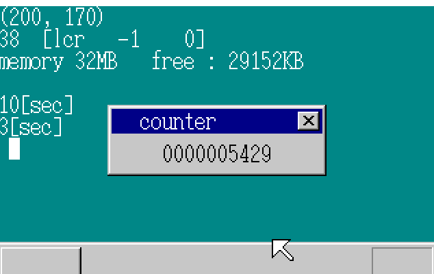
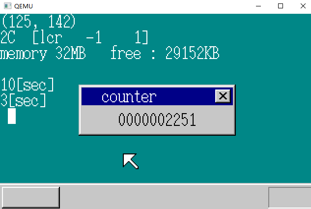

# 定时器（1）

## 1.使用定时器

Timer对操作系统来说非常重要，但原理只是：每隔一定时间（0.01s）发送一个中断信号给CPU。

如果不存在Timer，当程序执行HLT指令时，就不知道时间了。

**PIT**		 *Programmable Interval Timer* 	可编程的间隔型定时器 

通过设定PIT，让定时器每隔多少秒产生中断，在电脑中**PIT连接着IRQ的0号**。

[^1]: 在旧的机器上PIT是一个独立芯片安装在主板上，现在已经和PIC一样被集成到别的芯片中了。

+ IRQ0的中断周期变更：

+ AL = 0x34：OUT（0x43， AL）；

+ AL = 中断周期的低8位； OUT（0x40，AL）；

+ AL = 中断周期的高8位； OUT（0x40，AL）；

+ 到这里告一段落

  实际的中断产生的频率是**单位时间时钟周期数（主频**）/ 设定的数值。我们设定为11932，中断频率对应为100Hz  。 11932 = 0x2e9c

```C
#define PIT_CTRL	0x0043
#define PIT_CNT0	0x0040

void init_pit(void)
{
	io_out8(PIT_CTRL, 0x34);
	io_out8(PIT_CNT0, 0x9c); // 低8位
	io_out8(PIT_CNT0, 0x2e); // 高8位
	return;
}
```

```C
void HariMain(void)
{
    //-------------------------------------------------------
	init_gdtidt();
	init_pic();
	io_sti(); /* IDT/PICの初期化が終わったのでCPUの割り込み禁止を解除 */
	fifo8_init(&keyfifo, 32, keybuf);
	fifo8_init(&mousefifo, 128, mousebuf);
	init_pit();
	io_out8(PIC0_IMR, 0xf8); /* PITとPIC1とキーボードを許可(11111000) */
	io_out8(PIC1_IMR, 0xef); /* マウスを許可(11101111) */
    //-------------------------------------------------------
}
```

这样的话IRQ0就会在1s内发生100次中断了。

```C
void inthandler20(int *esp)
{
	io_out8(PIC0_OCW2, 0x60);	/* 把IRQ-00信号接收完了的信息通知给PIC */
	/* 暂时什么也不做 */
	return;
}
```

```assembly
_asm_inthandler20:
		PUSH	ES
		PUSH	DS
		PUSHAD
		MOV		EAX,ESP
		PUSH	EAX
		MOV		AX,SS
		MOV		DS,AX
		MOV		ES,AX
		CALL	_inthandler20
		POP		EAX
		POPAD
		POP		DS
		POP		ES
		IRETD
```

```C
void init_gdtidt(void){
    // -------------------------------------
	set_gatedesc(idt + 0x20, (int) asm_inthandler20, 2 * 8, AR_INTGATE32);
	set_gatedesc(idt + 0x21, (int) asm_inthandler21, 2 * 8, AR_INTGATE32);
	set_gatedesc(idt + 0x27, (int) asm_inthandler27, 2 * 8, AR_INTGATE32);
	set_gatedesc(idt + 0x2c, (int) asm_inthandler2c, 2 * 8, AR_INTGATE32);
    // -------------------------------------
}
```

## 2.计量时间

```C
struct TIMERCTL {
	unsigned int count;
};
#define PIT_CTRL	0x0043
#define PIT_CNT0	0x0040
struct TIMERCTL timerctl;
void init_pit(void)
{
	io_out8(PIT_CTRL, 0x34);
	io_out8(PIT_CNT0, 0x9c);
	io_out8(PIT_CNT0, 0x2e);
	timerctl.count = 0;
	return;
}
void inthandler20(int *esp)
{
	io_out8(PIC0_OCW2, 0x60);	/* IRQ-00受付完了をPICに通知 */
	timerctl.count++;  // 每次中断count++
	return;
}
```

即每秒 count 增加100; 每次中断 count ++；

显示count：

```C
void HariMain(){
    // -------------------------------------------------------------
	for (;;) {
		sprintf(s, "%010d", timerctl.count);
		boxfill8(buf_win, 160, COL8_C6C6C6, 40, 28, 119, 43);
		putfonts8_asc(buf_win, 160, 40, 28, COL8_000000, s);
		sheet_refresh(sht_win, 40, 28, 120, 44);
	// -------------------------------------------------------------
}
```



## 3.超时功能

利用次计时器，记录某一个操作的时间。

**基准测试程序**  	*benchmark program* 

**超时** 					*timeout*

```c
struct TIMERCTL {
	unsigned int count;
	unsigned int timeout; 	// 记录超时
	struct FIFO8 *fifo;		// 使用fifo缓冲区
	unsigned char data;
};
```

```C
#define PIT_CTRL	0x0043
#define PIT_CNT0	0x0040
struct TIMERCTL timerctl;
void init_pit(void)
{
	io_out8(PIT_CTRL, 0x34);
	io_out8(PIT_CNT0, 0x9c);
	io_out8(PIT_CNT0, 0x2e);
	timerctl.count = 0;
	timerctl.timeout = 0;
	return;
}

void inthandler20(int *esp)
{
	io_out8(PIC0_OCW2, 0x60);	/* IRQ-00受付完了をPICに通知 */
	timerctl.count++;
	if (timerctl.timeout > 0) { /* 如果设定了超时 */
		timerctl.timeout--;
		if (timerctl.timeout == 0) {
            // timeout-- 直到为 0 向 fifo发送消息
			fifo8_put(timerctl.fifo, timerctl.data);
		}
	}
	return;
}
void settimer(unsigned int timeout, struct FIFO8 *fifo, unsigned char data)
{
	int eflags;
	eflags = io_load_eflags();
	io_cli();
	timerctl.timeout = timeout;
	timerctl.fifo = fifo;
	timerctl.data = data;
	io_store_eflags(eflags);
	return;
}
```

```C
void HariMain(void)
{
	struct FIFO8 timerfifo;
	char s[40], keybuf[32], mousebuf[128], timerbuf[8];
    
	fifo8_init(&timerfifo, 8, timerbuf);
	settimer(100, &timerfifo, 1); // 设置 1 s

	for (;;) {
        
		io_cli();
		if (fifo8_status(&keyfifo) + fifo8_status(&mousefifo) + fifo8_status(&timerfifo) == 0) {
			io_sti();
		} else {
			if (fifo8_status(&keyfifo) != 0) {
			} else if (fifo8_status(&mousefifo) != 0) {
				i = fifo8_get(&mousefifo);
				io_sti();

			} else if (fifo8_status(&timerfifo) != 0) {
				i = fifo8_get(&timerfifo); /* とりあえず読み込む（からにするために） */
				io_sti();
				putfonts8_asc(buf_back, binfo->scrnx, 0, 64, COL8_FFFFFF, "10[sec]");
				sheet_refresh(sht_back, 0, 64, 56, 80);
			}
		}
	}
}
```



## 4.使用多个计时器

计时器可以用于 监视没有中断功能的装置、实现光标的闪烁功能

```C
#define MAX_TIMER		500
struct TIMER {
	unsigned int timeout, flags;
	struct FIFO8 *fifo;
	unsigned char data;
};
struct TIMERCTL {
	unsigned int count;
	struct TIMER timer[MAX_TIMER];
};
```

```C
#define PIT_CTRL	0x0043
#define PIT_CNT0	0x0040
struct TIMERCTL timerctl;
#define TIMER_FLAGS_ALLOC		1		/* 已配置状态 */
#define TIMER_FLAGS_USING		2		/* 定时器运行中 */
void init_pit(void)
{
	int i;
	io_out8(PIT_CTRL, 0x34);
	io_out8(PIT_CNT0, 0x9c);
	io_out8(PIT_CNT0, 0x2e);
	timerctl.count = 0;
	for (i = 0; i < MAX_TIMER; i++) {
		timerctl.timer[i].flags = 0; 	/* 未使用 */
	}
	return;
}
struct TIMER *timer_alloc(void)
{
	int i;
	for (i = 0; i < MAX_TIMER; i++) {
		if (timerctl.timer[i].flags == 0) {
			timerctl.timer[i].flags = TIMER_FLAGS_ALLOC;
			return &timerctl.timer[i];
		}
	}
	return 0; /* 没找到 */
}
void timer_free(struct TIMER *timer)
{
	timer->flags = 0; /* 未使用 */
	return;
}
void timer_init(struct TIMER *timer, struct FIFO8 *fifo, unsigned char data)
{
	timer->fifo = fifo;
	timer->data = data;
	return;
}
void timer_settime(struct TIMER *timer, unsigned int timeout)
{
	timer->timeout = timeout;
	timer->flags = TIMER_FLAGS_USING;
	return;
}
void inthandler20(int *esp)
{
	int i;
	io_out8(PIC0_OCW2, 0x60);	/* IRQ-00把接收结束的消息通知给PIC */
	timerctl.count++;
	for (i = 0; i < MAX_TIMER; i++) {
		if (timerctl.timer[i].flags == TIMER_FLAGS_USING) {
			timerctl.timer[i].timeout--;
			if (timerctl.timer[i].timeout == 0) {
				timerctl.timer[i].flags = TIMER_FLAGS_ALLOC;
				fifo8_put(timerctl.timer[i].fifo, timerctl.timer[i].data);
			}
		}
	}
	return;
}
```

HariMain() :

```C
void HariMain(void)
{
	struct FIFO8 timerfifo, timerfifo2, timerfifo3;
	char s[40], keybuf[32], mousebuf[128], timerbuf[8], timerbuf2[8], timerbuf3[8];
	struct TIMER *timer, *timer2, *timer3;

	fifo8_init(&timerfifo, 8, timerbuf);
	timer = timer_alloc();
	timer_init(timer, &timerfifo, 1);
	timer_settime(timer, 1000);			//10	ms
    
    fifo8_init(&timerfifo2, 8, timerbuf2);
	timer2 = timer_alloc();
	timer_init(timer2, &timerfifo2, 1);
	timer_settime(timer2, 300);			//300	ms
    
	fifo8_init(&timerfifo3, 8, timerbuf3);
	timer3 = timer_alloc();
	timer_init(timer3, &timerfifo3, 1);
	timer_settime(timer3, 50);			//50	ms

	for (;;) {
		sprintf(s, "%010d", timerctl.count);
		boxfill8(buf_win, 160, COL8_C6C6C6, 40, 28, 119, 43);
		putfonts8_asc(buf_win, 160, 40, 28, COL8_000000, s);
		sheet_refresh(sht_win, 40, 28, 120, 44);

		io_cli();
		if (fifo8_status(&keyfifo) + fifo8_status(&mousefifo) + fifo8_status(&timerfifo)
				+ fifo8_status(&timerfifo2) + fifo8_status(&timerfifo3) == 0) {
			io_sti();
		} else {
			if (fifo8_status(&keyfifo) != 0) {
				
			} else if (fifo8_status(&mousefifo) != 0) {
                
			} else if (fifo8_status(&timerfifo) != 0) {
				i = fifo8_get(&timerfifo); /* 首先读入 （为了设置起始点） */
				io_sti();
				putfonts8_asc(buf_back, binfo->scrnx, 0, 64, COL8_FFFFFF, "10[sec]");
				sheet_refresh(sht_back, 0, 64, 56, 80);
			} else if (fifo8_status(&timerfifo2) != 0) {
				i = fifo8_get(&timerfifo2); /* 首先读入 （为了设置起始点） */
				io_sti();
				putfonts8_asc(buf_back, binfo->scrnx, 0, 80, COL8_FFFFFF, "3[sec]");
				sheet_refresh(sht_back, 0, 80, 48, 96);
			} else if (fifo8_status(&timerfifo3) != 0) {
				i = fifo8_get(&timerfifo3);
				io_sti();
				if (i != 0) {
					timer_init(timer3, &timerfifo3, 0); /* 然后设置 0 */
					boxfill8(buf_back, binfo->scrnx, COL8_FFFFFF, 8, 96, 15, 111);
				} else {
					timer_init(timer3, &timerfifo3, 1); /* 然后设置 1 */
					boxfill8(buf_back, binfo->scrnx, COL8_008484, 8, 96, 15, 111);
				}
				timer_settime(timer3, 50);
				sheet_refresh(sht_back, 8, 96, 16, 112);
			}
		}
	}
}
```



## 5.加快中断处理（1）

在处理inthandler20时花费时间很长，阻碍了其他中断程序的执行。

每次在执行中断处理时，都会对 timerctl.timer[i].timeout--; 

```C
void inthandler20(int *esp)
{
	int i;
	io_out8(PIC0_OCW2, 0x60);	/* IRQ-00受付完了をPICに通知 */
	timerctl.count++;
	for (i = 0; i < MAX_TIMER; i++) {
		if (timerctl.timer[i].flags == TIMER_FLAGS_USING) {
			timerctl.timer[i].timeout--;
			if (timerctl.timer[i].timeout == 0) {
				timerctl.timer[i].flags = TIMER_FLAGS_ALLOC;
				fifo8_put(timerctl.timer[i].fifo, timerctl.timer[i].data);
			}
		}
	}
	return;
}
```

修改为

```C
void inthandler20(int *esp)
{
	int i;
	io_out8(PIC0_OCW2, 0x60);	/* IRQ-00受付完了をPICに通知 */
	timerctl.count++;
	for (i = 0; i < MAX_TIMER; i++) {
		if (timerctl.timer[i].flags == TIMER_FLAGS_USING) {
			if (timerctl.timer[i].timeout <= timerctl.count) {
				timerctl.timer[i].flags = TIMER_FLAGS_ALLOC;
				fifo8_put(timerctl.timer[i].fifo, timerctl.timer[i].data);
	}}}
	return;
}
```

改变 **timeout** 的含义，所指不再是**“所剩时间”**，而是**“予定时刻”**。

```V
void timer_settime(struct TIMER *timer, unsigned int timeout)
{
	timer->timeout = timeout + timerctl.count;
	timer->flags = TIMER_FLAGS_USING;
	return;
}
```

在这种方式，启动系统后经过42949673s后，timer.count就会变成0xffffffff，满掉。需要重启操作系统。

设定一个时间让所有值都减去那个值。

## 6.加快中断处理（2）

```C
	for (i = 0; i < MAX_TIMER; i++) {
		if (timerctl.timer[i].flags == TIMER_FLAGS_USING) {
			if (timerctl.timer[i].timeout <= timerctl.count) {
				timerctl.timer[i].flags = TIMER_FLAGS_ALLOC;
				fifo8_put(timerctl.timer[i].fifo, timerctl.timer[i].data);
	}}}
```

之前的for循环要执行500次，而1s要发生100次中断，就很浪费时间

增加变量 timerctl.next 让它记住下一个时刻

```C
struct TIMERCTL {
	unsigned int count, next;
	struct TIMER timer[MAX_TIMER];	
}
```

```C
void inthandler20(int *esp)
{
	int i;
	io_out8(PIC0_OCW2, 0x60);	/* IRQ-00受付完了をPICに通知 */
	timerctl.count++;
	if (timerctl.next > timerctl.count) {
		return; /* 没有到达下一个时刻，直接返回 */
	}
	timerctl.next = 0xffffffff;
	for (i = 0; i < MAX_TIMER; i++) {
		if (timerctl.timer[i].flags == TIMER_FLAGS_USING) {
			if (timerctl.timer[i].timeout <= timerctl.count) {
				/* 超时 */
				timerctl.timer[i].flags = TIMER_FLAGS_ALLOC;
				fifo8_put(timerctl.timer[i].fifo, timerctl.timer[i].data);
			} else {
				/* 还没有超时 */
				if (timerctl.next > timerctl.timer[i].timeout) {
                    // 选择timeout小的
					timerctl.next = timerctl.timer[i].timeout;
				}
			}
		}
	}
	return;
}
```


```C
void init_pit(void)
{
	int i;
	io_out8(PIT_CTRL, 0x34);
	io_out8(PIT_CNT0, 0x9c);
	io_out8(PIT_CNT0, 0x2e);
	timerctl.count = 0;
	timerctl.next = 0xffffffff; /* 因为最初没有正在运行的定时器 */
	for (i = 0; i < MAX_TIMER; i++) {
		timerctl.timer[i].flags = 0; /* 未使用 */
	}
	return;
}
void timer_settime(struct TIMER *timer, unsigned int timeout)
{
	timer->timeout = timeout + timerctl.count;
	timer->flags = TIMER_FLAGS_USING;
	if (timerctl.next > timer->timeout) {
		/* 更新为自己的时间 */
		timerctl.next = timer->timeout;
	}
	return;
}
```


## 7.加快中断处理（3）

到达next时刻 和 没到达next时刻的中断处理时间相差很大，这样的数据结构不好。所以需要让next时刻的定时器中断的处理时间再缩短一些。

在编写窗口管理SHTCTL时，

```C
struct SHTCTL {
	unsigned char *vram, *map;
	int xsize, ysize, top;
	struct SHEET *sheets[MAX_SHEETS];
	struct SHEET sheets0[MAX_SHEETS];
};
```

我们用了 *sheets[] 作为按顺序排好的图层地址，所以我们在做定时器中断设计的时候也可以这样设计：

```C
struct TIMERCTL {
	unsigned int count, next, using;
	struct TIMER *timers[MAX_TIMER];
	struct TIMER timers0[MAX_TIMER];
};
```

**using** 相当于SHTCTL中的top，记录有几个定时器正处于活动。

```C
void inthandler20(int *esp)
{
	int i, j;
	io_out8(PIC0_OCW2, 0x60);	/* IRQ-00受付完了をPICに通知 */
	timerctl.count++;
	if (timerctl.next > timerctl.count) {
		return;
	}
	for (i = 0; i < timerctl.using; i++) {
		/* timersのタイマは全て動作中のものなので、flagsを確認しない */
		if (timerctl.timers[i]->timeout > timerctl.count) {
			break;
		}
		/* タイムアウト */
		timerctl.timers[i]->flags = TIMER_FLAGS_ALLOC;
		fifo8_put(timerctl.timers[i]->fifo, timerctl.timers[i]->data);
	}
	/* ちょうどi個のタイマがタイムアウトした。残りをずらす。 */
	timerctl.using -= i;
	for (j = 0; j < timerctl.using; j++) {
		timerctl.timers[j] = timerctl.timers[i + j];
	}
	if (timerctl.using > 0) {
		timerctl.next = timerctl.timers[0]->timeout;
	} else {
		timerctl.next = 0xffffffff;
	}
	return;
}
```

```C
void init_pit(void)
{
	int i;
	io_out8(PIT_CTRL, 0x34);
	io_out8(PIT_CNT0, 0x9c);
	io_out8(PIT_CNT0, 0x2e);
	timerctl.count = 0;
	timerctl.next = 0xffffffff; 		/* 因为最初没有正在运行的定时器 */
	timerctl.using = 0;
	for (i = 0; i < MAX_TIMER; i++) {
		timerctl.timers0[i].flags = 0; 	/* 未使用 */
	}
	return;
}
struct TIMER *timer_alloc(void)
{
	int i;
	for (i = 0; i < MAX_TIMER; i++) {
		if (timerctl.timers0[i].flags == 0) {
			timerctl.timers0[i].flags = TIMER_FLAGS_ALLOC;
			return &timerctl.timers0[i];
		}
	}
	return 0; 							/* 没找到 */
}

void timer_settime(struct TIMER *timer, unsigned int timeout)
{
	int e, i, j;
	timer->timeout = timeout + timerctl.count;
	timer->flags = TIMER_FLAGS_USING;
	e = io_load_eflags();
	io_cli(); 	// 关闭中断
	/* 搜索注册位置 */
	for (i = 0; i < timerctl.using; i++) {
		if (timerctl.timers[i]->timeout >= timer->timeout) {
			break;
		}
	}
	/* i号之后全部后移一位 */
	for (j = timerctl.using; j > i; j--) {
		timerctl.timers[j] = timerctl.timers[j - 1];
	}
	timerctl.using++;
	/* 插入到空位中 */
	timerctl.timers[i] = timer;
	timerctl.next = timerctl.timers[0]->timeout;
	io_store_eflags(e);
	return;
}
```

但是在设定定时器的时候，我们关闭了中断。




DAY 12 FINISH

TAKR-Zz