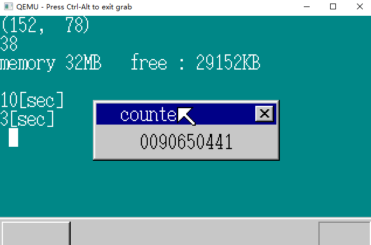
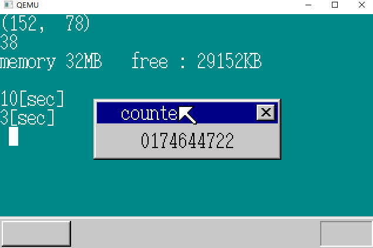
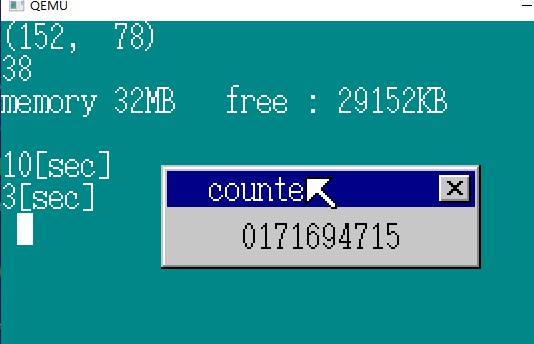

# 定时器2

## 1.简化字符串显示

将 buf_back 即背景窗口  先涂上背景色，再显示字符  的代码归结到一个函数中：

```C
void putfonts8_asc_sht(struct SHEET *sht, int x, int y, int c, int b, char *s, int l)
{
	boxfill8(sht->buf, sht->bxsize, b, x, y, x + l * 8 - 1, y + 15);
	putfonts8_asc(sht->buf, sht->bxsize, x, y, c, s);
	sheet_refresh(sht, x, y, x + l * 8, y + 16);
	return;
}
//	x, y	----- 坐标		 
//	c		----- 颜色		 color 
//	b		----- 背景颜色		back color
//	s		----- 字符串        string	
//	l		----- 字符串长度	    length
```


## 2.重新调整FIFO缓冲区

```C
if (fifo8_status(&keyfifo) + fifo8_status(&mousefifo) + fifo8_status(&timerfifo)
				+ fifo8_status(&timerfifo2) + fifo8_status(&timerfifo3) == 0) {
			io_sti();
		} else {
```

每一个定时器都需要写一个 fifo8_status() ，集中成一个，每次超时时往FIFO中写入的内容不同以区分定时器

```C
fifo8_init(&timerfifo, 8, timerbuf);
timer = timer_alloc();
timer_init(timer, &timerfifo, 10);
timer_settime(timer, 1000);
timer2 = timer_alloc();
timer_init(timer2, &timerfifo, 3);
timer_settime(timer2, 300);
timer3 = timer_alloc();
timer_init(timer3, &timerfifo, 1);
timer_settime(timer3, 50);
```

```C
for (;;) {
		sprintf(s, "%010d", timerctl.count);
		putfonts8_asc_sht(sht_win, 40, 28, COL8_000000, COL8_C6C6C6, s, 10);

		io_cli();
		if (fifo8_status(&keyfifo) + fifo8_status(&mousefifo) + fifo8_status(&timerfifo) == 0) {
			io_sti();
		} else {
			if (fifo8_status(&keyfifo) != 0) {
			} else if (fifo8_status(&mousefifo) != 0) {
			} else if (fifo8_status(&timerfifo) != 0) {
                // 取出 fifo 中传入的 data
				i = fifo8_get(&timerfifo); /* 超时的是哪一个？ */
				io_sti();
				if (i == 10) {
					putfonts8_asc_sht(sht_back, 0, 64, COL8_FFFFFF, COL8_008484, "10[sec]", 7);
				} else if (i == 3) {
					putfonts8_asc_sht(sht_back, 0, 80, COL8_FFFFFF, COL8_008484, "3[sec]", 6);
				} else {
					/* 0 还是 1？ */
					if (i != 0) {
						timer_init(timer3, &timerfifo, 0); /* 下面设定是 0 */
						boxfill8(buf_back, binfo->scrnx, COL8_FFFFFF, 8, 96, 15, 111);
					} else {
						timer_init(timer3, &timerfifo, 1); /* 下面设定是 1 */
						boxfill8(buf_back, binfo->scrnx, COL8_008484, 8, 96, 15, 111);
					}
					timer_settime(timer3, 50);
					sheet_refresh(sht_back, 8, 96, 16, 112);
				}
			}
		}
	}
```


## 3.测试性能

```C
int mx, my, i, count = 0;
for (;;) {
		count++;

		io_cli();
		if (fifo8_status(&keyfifo) + fifo8_status(&mousefifo) + fifo8_status(&timerfifo) == 0) {
			io_sti();
		} else {
			if (fifo8_status(&keyfifo) != 0) {
			} else if (fifo8_status(&mousefifo) != 0) {
			} else if (fifo8_status(&timerfifo) != 0) {
				i = fifo8_get(&timerfifo); /* 超时 data  */
				io_sti();
				if (i == 10) {
					putfonts8_asc_sht(sht_back, 0, 64, COL8_FFFFFF, COL8_008484, "10[sec]", 7);
					sprintf(s, "%010d", count);
					putfonts8_asc_sht(sht_win, 40, 28, COL8_000000, COL8_C6C6C6, s, 10);
				} else if (i == 3) {
					putfonts8_asc_sht(sht_back, 0, 80, COL8_FFFFFF, COL8_008484, "3[sec]", 6);
					count = 0; /* 测定开始 */
				} else {
					/* 0 或 1 */
					if (i != 0) {
						timer_init(timer3, &timerfifo, 0); /* 次は0を */
						boxfill8(buf_back, binfo->scrnx, COL8_FFFFFF, 8, 96, 15, 111);
					} else {
						timer_init(timer3, &timerfifo, 1); /* 次は1を */
						boxfill8(buf_back, binfo->scrnx, COL8_008484, 8, 96, 15, 111);
					}
					timer_settime(timer3, 50);
					sheet_refresh(sht_back, 8, 96, 16, 112);
				}
			}
		}
	
```



五次结果：

```
0090650441
0091904247
0092800396
0092257617
0085168808
```

相差很大，是因为windows系统的影响， 再测试harib10d发现 c 确实比 d 快数万个中断。

```
harib10d	最初版本
harib10e	舍弃剩余时间，记忆超时时刻
harib10f	导入next
harib10c	导入timers[ ]
```

**启动3s后将count置零的原因 ：**  电脑初始化的时间不同

## 4.重新调整FIFO缓冲区（2）

既然已经降个计时器都放在一个FIFO缓冲区中，那我们也可以将鼠标和键盘放在一个缓冲区中，同理，让鼠标和键盘传到fifo中的data不同。用一个fifo缓冲区实现所有：

```
0 ~ 1		-------------	光标闪烁用定时器
3			-------------	3s定时器
10			-------------	10s定时器
256 ~ 511	-------------	键盘输入（键盘控制器读入的值再加上256）
512 ~ 767	-------------	鼠标输入（鼠标控制器再加上512）
```

但是因为 fifo8_put() 中的参数是char型，  1 BYTE， 不能指定大的数字，所以重写了 fifo32： int

```C
struct FIFO32 {  // 32 位的 FIFO 缓冲区
	int *buf;
	int p, q, size, free, flags;
};
void fifo32_init(struct FIFO32 *fifo, int size, int *buf)
/* FIFOバッファの初期化 */
{
	fifo->size = size;
	fifo->buf = buf;
	fifo->free = size; /* 空 */
	fifo->flags = 0;
	fifo->p = 0; /* 写入位置 */
	fifo->q = 0; /* 读出位置 */
	return;
}
int fifo32_put(struct FIFO32 *fifo, int data)
/* 给FIFO发送数据并存储在FIFO中 */
{
	if (fifo->free == 0) {
		/* 空きがなくてあふれた */
		fifo->flags |= FLAGS_OVERRUN;
		return -1;
	}
	fifo->buf[fifo->p] = data;
	fifo->p++;
	if (fifo->p == fifo->size) {
		fifo->p = 0;
	}
	fifo->free--;
	return 0;
}
int fifo32_get(struct FIFO32 *fifo)
/* FIFOからデータを一つとってくる */
{
	int data;
	if (fifo->free == fifo->size) {
		/* バッファが空っぽのときは、とりあえず-1が返される */
		return -1;
	}
	data = fifo->buf[fifo->q];
	fifo->q++;
	if (fifo->q == fifo->size) {
		fifo->q = 0;
	}
	fifo->free++;
	return data;
}
int fifo32_status(struct FIFO32 *fifo)
/* どのくらいデータが溜まっているかを報告する */
{
	return fifo->size - fifo->free;
}
```

利用FIFO32重写keyboard mouse

```C
struct FIFO32 *keyfifo;
int keydata0; // 256
void inthandler21(int *esp)
{
	int data;
	io_out8(PIC0_OCW2, 0x61);	/* IRQ-01受付完了をPICに通知 */
	data = io_in8(PORT_KEYDAT);
	fifo32_put(keyfifo, data + keydata0);
	return;
}
#define PORT_KEYSTA				0x0064
#define KEYSTA_SEND_NOTREADY	0x02
#define KEYCMD_WRITE_MODE		0x60
#define KBC_MODE				0x47
void wait_KBC_sendready(void)
{
	/* キーボードコントローラがデータ送信可能になるのを待つ */
	for (;;) {
		if ((io_in8(PORT_KEYSTA) & KEYSTA_SEND_NOTREADY) == 0) {
			break;
		}
	}
	return;
}
void init_keyboard(struct FIFO32 *fifo, int data0)
{
	/* 将FIFO缓冲区的信息放在 全局变量 中 */
	keyfifo = fifo;
	keydata0 = data0;
	/* 键盘控制器的初始化 */
	wait_KBC_sendready();
	io_out8(PORT_KEYCMD, KEYCMD_WRITE_MODE);
	wait_KBC_sendready();
	io_out8(PORT_KEYDAT, KBC_MODE);
	return;
}
```

```C
struct MOUSE_DEC {
	unsigned char buf[3], phase;
	int x, y, btn;
};

struct FIFO32 *mousefifo;
int mousedata0; // 512
void inthandler2c(int *esp)
	/* 基于PS/2鼠标的中断 */
{
	int data;
	io_out8(PIC1_OCW2, 0x64);	/* IRQ-12受付完了をPIC1に通知 */
	io_out8(PIC0_OCW2, 0x62);	/* IRQ-02受付完了をPIC0に通知 */
	data = io_in8(PORT_KEYDAT);
	fifo32_put(mousefifo, data + mousedata0);/
	return;
}

#define KEYCMD_SENDTO_MOUSE		0xd4
#define MOUSECMD_ENABLE			0xf4
#define PORT_KEYDAT		0x0060
#define PORT_KEYCMD		0x0064

void enable_mouse(struct FIFO32 *fifo, int data0, struct MOUSE_DEC *mdec)
{
	/* 将FIFO缓冲区的信息保存到 全局变量 中 */
	mousefifo = fifo;
	mousedata0 = data0;
	/* 鼠标有效 */
	wait_KBC_sendready();
	io_out8(PORT_KEYCMD, KEYCMD_SENDTO_MOUSE);
	wait_KBC_sendready();
	io_out8(PORT_KEYDAT, MOUSECMD_ENABLE);
	/* 顺利的话， ACK（0xfa）会被发送 */
	mdec->phase = 0; /* 等待鼠标的0xfa阶段 */
	return;
}
```

```C
struct TIMER {
	unsigned int timeout, flags;
	struct FIFO32 *fifo;
	int data;
};

#include "bootpack.h"
#define PIT_CTRL	0x0043
#define PIT_CNT0	0x0040
struct TIMERCTL timerctl;
#define TIMER_FLAGS_ALLOC		1	/* 確保した状態 */
#define TIMER_FLAGS_USING		2	/* タイマ作動中 */

void init_pit(void)
{
	int i;
	io_out8(PIT_CTRL, 0x34);
	io_out8(PIT_CNT0, 0x9c);
	io_out8(PIT_CNT0, 0x2e);
	timerctl.count = 0;
	timerctl.next = 0xffffffff; /* 最初は作動中のタイマがないので */
	timerctl.using = 0;
	for (i = 0; i < MAX_TIMER; i++) {
		timerctl.timers0[i].flags = 0; /* 未使用 */
	}
	return;
}
struct TIMER *timer_alloc(void)
{
	int i;
	for (i = 0; i < MAX_TIMER; i++) {
		if (timerctl.timers0[i].flags == 0) {
			timerctl.timers0[i].flags = TIMER_FLAGS_ALLOC;
			return &timerctl.timers0[i];
		}
	}
	return 0; /* 見つからなかった */
}
void timer_free(struct TIMER *timer)
{
	timer->flags = 0; /* 未使用 */
	return;
}
void timer_init(struct TIMER *timer, struct FIFO32 *fifo, int data)
{
	timer->fifo = fifo;
	timer->data = data;
	return;
}
void timer_settime(struct TIMER *timer, unsigned int timeout)
{
	int e, i, j;
	timer->timeout = timeout + timerctl.count;
	timer->flags = TIMER_FLAGS_USING;
	e = io_load_eflags();
	io_cli();
	/* どこに入れればいいかを探す */
	for (i = 0; i < timerctl.using; i++) {
		if (timerctl.timers[i]->timeout >= timer->timeout) {
			break;
		}
	}
	/* うしろをずらす */
	for (j = timerctl.using; j > i; j--) {
		timerctl.timers[j] = timerctl.timers[j - 1];
	}
	timerctl.using++;
	/* あいたすきまに入れる */
	timerctl.timers[i] = timer;
	timerctl.next = timerctl.timers[0]->timeout;
	io_store_eflags(e);
	return;
}
void inthandler20(int *esp)
{
	int i, j;
	io_out8(PIC0_OCW2, 0x60);	/* IRQ-00受付完了をPICに通知 */
	timerctl.count++;
	if (timerctl.next > timerctl.count) {
		return;
	}
	for (i = 0; i < timerctl.using; i++) {
		/* 因为timers的定时器都处于运行状态，所以不确定flags */
		if (timerctl.timers[i]->timeout > timerctl.count) {
			break;
		}
		/* 超时 */
		timerctl.timers[i]->flags = TIMER_FLAGS_ALLOC;
		fifo32_put(timerctl.timers[i]->fifo, timerctl.timers[i]->data);
	}
	/* 正好有i个timer超时了， 移位 */
	timerctl.using -= i; // i <= using
	for (j = 0; j < timerctl.using; j++) {
		timerctl.timers[j] = timerctl.timers[i + j];
	}
	if (timerctl.using > 0) {
		timerctl.next = timerctl.timers[0]->timeout;
	} else {
		timerctl.next = 0xffffffff;
	}
	return;
}
```

最后修改HariMain（）：

```C
void HariMain(void)
{
	struct FIFO32 fifo;
	char s[40];
	int fifobuf[128];
	// ------------------------------------------
	fifo32_init(&fifo, 128, fifobuf);
	init_keyboard(&fifo, 256);
	enable_mouse(&fifo, 512, &mdec);
	io_out8(PIC0_IMR, 0xf8); /* 设定PIT和PIC1以及键盘许可（11111100） */
	io_out8(PIC1_IMR, 0xef); /* 设定鼠标许可(11101111) */

	timer = timer_alloc();
	timer_init(timer, &fifo, 10);
	timer_settime(timer, 1000);
	timer2 = timer_alloc();
	timer_init(timer2, &fifo, 3);
	timer_settime(timer2, 300);
	timer3 = timer_alloc();
	timer_init(timer3, &fifo, 1);
	timer_settime(timer3, 50);
    //--------------------------------------------

	for (;;) {
		count++;

		io_cli();
		if (fifo32_status(&fifo) == 0) {
			io_sti();
		} else {
			i = fifo32_get(&fifo);
			io_sti();
			if (256 <= i && i <= 511) {  // 键盘中断
				sprintf(s, "%02X", i - 256);
				putfonts8_asc_sht(sht_back, 0, 16, COL8_FFFFFF, COL8_008484, s, 2);
			} else if (512 <= i && i <= 767) { /* 鼠标中断 */
				if (mouse_decode(&mdec, i - 512) != 0) {
					/* 已收集了3BYTE的数据，显示出来 */
					sprintf(s, "[lcr %4d %4d]", mdec.x, mdec.y);
					if ((mdec.btn & 0x01) != 0) {
						s[1] = 'L';
					}
					if ((mdec.btn & 0x02) != 0) {
						s[3] = 'R';
					}
					if ((mdec.btn & 0x04) != 0) {
						s[2] = 'C';
					}
					putfonts8_asc_sht(sht_back, 32, 16, COL8_FFFFFF, COL8_008484, s, 15);
					/* 鼠标指针的移动 */
					mx += mdec.x;
					my += mdec.y;
					if (mx < 0) {
						mx = 0;
					}
					if (my < 0) {
						my = 0;
					}
					if (mx > binfo->scrnx - 1) {
						mx = binfo->scrnx - 1;
					}
					if (my > binfo->scrny - 1) {
						my = binfo->scrny - 1;
					}
					sprintf(s, "(%3d, %3d)", mx, my);
					putfonts8_asc_sht(sht_back, 0, 0, COL8_FFFFFF, COL8_008484, s, 10);
					sheet_slide(sht_mouse, mx, my);
				}
			} else if (i == 10) { /* 10s定时器 */
				putfonts8_asc_sht(sht_back, 0, 64, COL8_FFFFFF, COL8_008484, "10[sec]", 7);
				sprintf(s, "%010d", count);
				putfonts8_asc_sht(sht_win, 40, 28, COL8_000000, COL8_C6C6C6, s, 10);
			} else if (i == 3) { /* 3s定时器 */
				putfonts8_asc_sht(sht_back, 0, 80, COL8_FFFFFF, COL8_008484, "3[sec]", 6);
				count = 0; /* 开始测试 */
			} else if (i == 1) { /* 光标 */
				timer_init(timer3, &fifo, 0); /* 下面设定为0 */
				boxfill8(buf_back, binfo->scrnx, COL8_FFFFFF, 8, 96, 15, 111);
				timer_settime(timer3, 50);
				sheet_refresh(sht_back, 8, 96, 16, 112);
			} else if (i == 0) { /* 光标 */
				timer_init(timer3, &fifo, 1); /* 下面设定为1 */
				boxfill8(buf_back, binfo->scrnx, COL8_008484, 8, 96, 15, 111);
				timer_settime(timer3, 50);
				sheet_refresh(sht_back, 8, 96, 16, 112);
			}
		}
	}
}
```



在模拟器下，中断次数多了接进一倍！程序只需要查看一个FIFO缓冲区，而以前要看3个。

## 5.加快中断处理

改良 inthandler20中最后的移位处理和timer_settime中的移位处理。

FIFO中有一个**取代移位处理**的方法：读取一个字符以后不是让以后的数据向前靠齐，而是改变下一次读取数据的位置 **p q** 。但问题在于，用timer_settime登录中断后，后面的timmer必须后移。 **链？**

**采用链表结构！**    **线性表 Linear List**

```C
struct TIMER {
	struct TIMER *next;
	unsigned int timeout, flags;
	struct FIFO32 *fifo;
	int data;
};
struct TIMERCTL {
	unsigned int count, next, using;
	struct TIMER *t0;
	struct TIMER timers0[MAX_TIMER];
};
void timer_settime(struct TIMER *timer, unsigned int timeout)
{
	int e;
	struct TIMER *t, *s;
	timer->timeout = timeout + timerctl.count;
	timer->flags = TIMER_FLAGS_USING;
	e = io_load_eflags();
	io_cli();
	timerctl.using++;
	if (timerctl.using == 1) {
		/* 处于运行状态的timer只有你一个 */
		timerctl.t0 = timer;
		timer->next = 0; /* 下一个为空 */
		timerctl.next = timer->timeout;
		io_store_eflags(e);
		return;
	}
	t = timerctl.t0;
	if (timer->timeout <= t->timeout) {
		/* 插入最前面的情况 */
		timerctl.t0 = timer;
		timer->next = t; /* 下面是 t */
		timerctl.next = timer->timeout;
		io_store_eflags(e);
		return;
	}
	/* どこに入れればいいかを探す */
	for (;;) {
		s = t;
		t = t->next;
		if (t == 0) {
			break; /* 最后面 */
		}
		if (timer->timeout <= t->timeout) {
			/* 插入 s 和 t 之间 */
			s->next = timer; /* s 的下一个是 timer */
			timer->next = t; /* timer 的下一个是 t */
			io_store_eflags(e);
			return;
		}
	}
	/* 插入最后面的情况下 */
	s->next = timer;
	timer->next = 0;
	io_store_eflags(e);
	return;
}

void inthandler20(int *esp)
{
	int i;
	struct TIMER *timer;
	io_out8(PIC0_OCW2, 0x60);	/* IRQ-00受付完了をPICに通知 */
	timerctl.count++;
	if (timerctl.next > timerctl.count) {
		return;
	}
	timer = timerctl.t0; /* とりあえず先頭の番地をtimerに代入 */
	for (i = 0; i < timerctl.using; i++) {
		/* timersのタイマは全て動作中のものなので、flagsを確認しない */
		if (timer->timeout > timerctl.count) {
			break;
		}
		/* タイムアウト */
		timer->flags = TIMER_FLAGS_ALLOC;
		fifo32_put(timer->fifo, timer->data);
		timer = timer->next; /* 次のタイマの番地をtimerに代入 */
	}
	timerctl.using -= i;

	/* 新しいずらし */
	timerctl.t0 = timer;

	/* timerctl.nextの設定 */
	if (timerctl.using > 0) {
		timerctl.next = timerctl.t0->timeout;
	} else {
		timerctl.next = 0xffffffff;
	}
	return;
}
```

## 6.使用“哨兵”简化程序

timer.c程序在去除移位处理后，其中的timer_settime函数还是有些冗长。我们继续想办法简化：

+ 运行中的timer只有一个的情况
+ 插入到最前面的情况
+ 插入到s和t之间的情况
+ 插入到最后的情况

在进行初始化的时候，将时刻 0xffffffff 的定时器连到最后一个定时器上。虽然我们偷了点懒没有设定FIFO等，但不必担心，因为不会到达这个时刻。他一直在最后面，只是一个附带物，是个留下来看家的留守者。这个留守者正是“哨兵”。

```C
void init_pit(void)
{
	int i;
	struct TIMER *t;
	io_out8(PIT_CTRL, 0x34);
	io_out8(PIT_CNT0, 0x9c);
	io_out8(PIT_CNT0, 0x2e);
	timerctl.count = 0;
	for (i = 0; i < MAX_TIMER; i++) {
		timerctl.timers0[i].flags = 0; /* 没有使用 */
	}
	t = timer_alloc(); /* 取得一个 */
	t->timeout = 0xffffffff;
	t->flags = TIMER_FLAGS_USING;
	t->next = 0; /* 末尾 */
	timerctl.t0 = t; /* 现在只有哨兵，所以他就在最前面 */
	timerctl.next = 0xffffffff; /* 因为只有哨兵，所以下一个超时时刻就是哨兵的时刻 */
	return;
}
```

如果使用在12.5中介绍的避免一年重启一次的程序，就得修改程序保证不改变哨兵的时刻。

```C
int t0 = timerctl.count;
io_cli();
timerctl.count -= t0;
for( i = 0; i < MAX_TIMER; i++){
	if(timerctl.timer[i].flags == TIMER_FLAGS_USING){
	// 这里判断.next属性会不会好一些 ？
		if(timerctl.timer[i].timeout != 0xffffffff){
			timerctl.timer[i].timeout -= t0;
		}
	}
}
io_sti();
```

由于加入了哨兵，4种情况就减少了2种 （1 4）

```C
void timer_settime(struct TIMER *timer, unsigned int timeout)
{
	int e;
	struct TIMER *t, *s;
	timer->timeout = timeout + timerctl.count;
	timer->flags = TIMER_FLAGS_USING;
	e = io_load_eflags();
	io_cli();
	t = timerctl.t0;
	if (timer->timeout <= t->timeout) {
		/* 插入到最前面 */
		timerctl.t0 = timer;
		timer->next = t; /* 次はt */
		timerctl.next = timer->timeout;
		io_store_eflags(e);
		return;
	}
	/* 搜寻插入的位置 */
	for (;;) {
		s = t;
		t = t->next;
		if (timer->timeout <= t->timeout) {
			/* 插入s和t之间的情况 */
			s->next = timer; /* s 下一个是 timer */
			timer->next = t; /* timer 下一个是 t */
			io_store_eflags(e);
			return;
		}
	}
}
// 简化 inthandler20（）
void inthandler20(int *esp)
{
	struct TIMER *timer;
	io_out8(PIC0_OCW2, 0x60);	/* IRQ-00受付完了をPICに通知 */
	timerctl.count++;
	if (timerctl.next > timerctl.count) {
		return;
	}
	timer = timerctl.t0; /* とりあえず先頭の番地をtimerに代入 */
	for (;;) {
		/* timersのタイマは全て動作中のものなので、flagsを確認しない */
		if (timer->timeout > timerctl.count) {
			break;
		}
		/* タイムアウト */
		timer->flags = TIMER_FLAGS_ALLOC;
		fifo32_put(timer->fifo, timer->data);
		timer = timer->next; /* 次のタイマの番地をtimerに代入 */
	}
	timerctl.t0 = timer;
	timerctl.next = timer->timeout;
	return;
}
```

到这里，timerctl.using就没有用处了。但是执行效率降低了。



DAY 13 FINISH

by TAKR - Zz