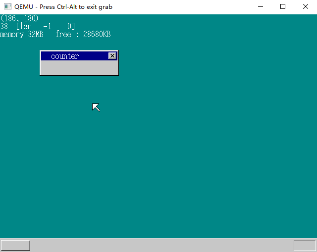

# 高分辨率及键盘输入

## 1.继续测试性能

上真机后数值变化不大，可能是windows的原因。因为改进在取消了移位处理，只有在多个timer时才能体现效果。

```C
void set490(struct FIFO32 *fifo, int mode)
{
	int i;
	struct TIMER *timer;
	if (mode != 0) {
		for (i = 0; i < 490; i++) {
			timer = timer_alloc();
			timer_init(timer, fifo, 1024 + i);
			timer_settime(timer, 100 * 60 * 60 * 24 * 50 + i * 100);
		}
	}
	return;
}
```

设置了490个 timer ，再次测试：


造成各个结果的差异很大的原因有：C Compiler的问题，在添加set490（&fifo,0)后，JMP指令跳转地址发生变化，导致执行时间延迟。

## 2.提高分辨率（1）

目前的窗口是320*200的画面，我们只能做支持QEMU模拟器显卡的窗口。

asmhead.nas:

```assembly
; 画面模式的设定

		MOV		BX,0x4101		; VBE的640*480*8bit彩色
		MOV		AX,0x4f02
		INT		0x10
		MOV		BYTE [VMODE],8	; 记下画面模式（参考C语言）
		MOV		WORD [SCRNX],640
		MOV		WORD [SCRNY],480
		MOV		DWORD [VRAM],0xe0000000
```



以前

```assembly
; 画面モードを設定
		MOV		AL,0x13			; VGAグラフィックス、320x200x8bitカラー
		MOV		AH,0x00
		INT		0x10
		MOV		BYTE [VMODE],8	; 画面モードをメモする（C言語が参照する）
		MOV		WORD [SCRNX],320
		MOV		WORD [SCRNY],200
		MOV		DWORD [VRAM],0x000a0000
```

多家显卡商成立VESA协会（Video Electronics Standards Association），指定了专用的BIOS： VESA BIOS extension  VBE。以前没有使用VBE，而现在使用了。

```
VBE 的 画面模式号码：
0x101------640x 480x 8bit 彩色
0x103------800x 600x 8bit 彩色
0x105------1024x 768x 8bit 彩色
0x107------1280x 1024x 8bit 彩色 // QEMU 无法使用
--------------------------------省略
```

实际使用，需要加上 0x4000 再放入BX


## 3.提高分辨率（2）

在真机中运行操作系统：


```assembly
; asmhead.nas
; 确认VBE是否存在

		MOV		AX,0x9000
		MOV		ES,AX
		MOV		DI,0
		MOV		AX,0x4f00
		INT		0x10
		CMP		AX,0x004f
		JNE		scrn320
```

如果有VBE的话，AX会变成0x004f，如果没有变为就说明没有VBE。

```assembly
; 检查VBE的版本

		MOV		AX,[ES:DI+4]
		CMP		AX,0x0200
		JB		scrn320			; if (AX < 0x0200) goto scrn320
```

确认AX的值，如果是0x004f以外的值，就意味着画面模式无法使用。

```assembly
; asmhead.nas
; 取得画面模式信息
	MOV		CX, VBEMODE
	MOV		AX, 0x4f01
	INT		0x10
	CMP		AX, 0x004f
	JNE		scrn320
```

本次取得的画面模式信息被写入内存中从 ES: DI开始的256字节中。

在画面模式的信息中，重要的有6个

```
WORD		[ES : DI + 0x00] : 模式属性······bit7不是1就不好办
WORD		[ES : DI + 0x12] : X 的分辨率
WORD		[ES : DI + 0x14] : Y 的分辨率
WORD		[ES : DI + 0x19] : 颜色数······必须为8
WORD		[ES : DI + 0x1b] : 颜色的指定方法·····必须为4（4是调色板模式）
WORD		[ES : DI + 0x28] : VRAM 的地址
```

+ 颜色数是否为 8
+ 是否为调色板模式
+ 画面模式号码可否加上0x4000再进行指定

```assembly
; 画面模式的确认
		CMP		BYTE [ES:DI+0x19],8
		JNE		scrn320
		CMP		BYTE [ES:DI+0x1b],4
		JNE		scrn320
		MOV		AX,[ES:DI+0x00]
		AND		AX,0x0080
		JZ		scrn320			; 模式属性的bit7是0，所以放弃
```

确认完成后，就可以将分辨率及VRAM地址等信息复制到BOOTINFO中了。

```assembly
; 画面模式的切换
		MOV		BX,VBEMODE+0x4000
		MOV		AX,0x4f02
		INT		0x10
		MOV		BYTE [VMODE],8	; 记下画面模式
		MOV		AX,[ES:DI+0x12]
		MOV		[SCRNX],AX
		MOV		AX,[ES:DI+0x14]
		MOV		[SCRNY],AX
		MOV		EAX,[ES:DI+0x28]
		MOV		[VRAM],EAX
		JMP		keystatus
```

```assembly
scrn320:
		MOV		AL,0x13			; VGA图、320 * 200 * 8bit 彩色
		MOV		AH,0x00
		INT		0x10
		MOV		BYTE [VMODE],8	; 记下画面模式
		MOV		WORD [SCRNX],320
		MOV		WORD [SCRNY],200
		MOV		DWORD [VRAM],0x000a0000
```


错误测试： 将VBEMODE 设置为 0x107


变成小窗口了！

## 4.键盘输入（1）


本次的HariMain（）：

```C
for (;;) {
		io_cli();
		if (fifo32_status(&fifo) == 0) {
			io_stihlt();
		} else {
			i = fifo32_get(&fifo);
			io_sti();
			if (256 <= i && i <= 511) { /* 键盘数据 */
				sprintf(s, "%02X", i - 256);
				putfonts8_asc_sht(sht_back, 0, 16, COL8_FFFFFF, COL8_008484, s, 2);
				if (i == 0x1e + 256) { // 如果是A 则
					putfonts8_asc_sht(sht_win, 40, 28, COL8_000000, COL8_C6C6C6, "A", 1);
				}
			}
  // --------------------------------------------------------
```


## 5.键盘输入（2）

```C
	static char keytable[0x54] = {
		0,   0,   '1', '2', '3', '4', '5', '6', '7', '8', '9', '0', '-', '^', 0,   0,
		'Q', 'W', 'E', 'R', 'T', 'Y', 'U', 'I', 'O', 'P', '@', '[', 0,   0,   'A', 'S',
		'D', 'F', 'G', 'H', 'J', 'K', 'L', ';', ':', 0,   0,   ']', 'Z', 'X', 'C', 'V',
		'B', 'N', 'M', ',', '.', '/', 0,   '*', 0,   ' ', 0,   0,   0,   0,   0,   0,
		0,   0,   0,   0,   0,   0,   0,   '7', '8', '9', '-', '4', '5', '6', '+', '1',
		'2', '3', '0', '.'
	};
	if (256 <= i && i <= 511) { 
		sprintf(s, "%02X", i - 256);
		putfonts8_asc_sht(sht_back, 0, 16, COL8_FFFFFF, COL8_008484, s, 2);
		if (i < 256 + 0x54) {
			if (keytable[i - 256] != 0) {
                s[0] = keytable[i - 256];
                s[1] = 0;
                putfonts8_asc_sht(sht_win, 40, 28, COL8_000000, COL8_C6C6C6, s, 1);	
            }		
        }
    }
```

将keytable[]设定为static char， 是因为希望程序被编译为汇编语言的时候，static char能编译成DB指令。


## 6.追记内容（1）

```C
if (256 <= i && i <= 511) { 
				sprintf(s, "%02X", i - 256);
				putfonts8_asc_sht(sht_back, 0, 16, COL8_FFFFFF, COL8_008484, s, 2);
				if (i < 0x54 + 256) {
					if (keytable[i - 256] != 0 && cursor_x < 144) { /* 通常文字 */
						/* 显示1个字符就前移一次光标 */
						s[0] = keytable[i - 256];
						s[1] = 0;
						putfonts8_asc_sht(sht_win, cursor_x, 28, COL8_000000, COL8_FFFFFF, s, 1);
						cursor_x += 8; // 光标的位置
					}
				}
				if (i == 256 + 0x0e && cursor_x > 8) { /* 退格键 */
					/* 用退格键将光标消除 后移光标 */
					putfonts8_asc_sht(sht_win, cursor_x, 28, COL8_000000, COL8_FFFFFF, " ", 1);
					cursor_x -= 8;
				}
				/* 光标再显示 */
    			// cursor_c 现在光标的颜色
				boxfill8(sht_win->buf, sht_win->bxsize, cursor_c, cursor_x, 28, cursor_x + 7, 43);
				sheet_refresh(sht_win, cursor_x, 28, cursor_x + 8, 44);
			}
```

```C
void make_textbox8(struct SHEET *sht, int x0, int y0, int sx, int sy, int c)
{
	int x1 = x0 + sx, y1 = y0 + sy;
	boxfill8(sht->buf, sht->bxsize, COL8_848484, x0 - 2, y0 - 3, x1 + 1, y0 - 3);
	boxfill8(sht->buf, sht->bxsize, COL8_848484, x0 - 3, y0 - 3, x0 - 3, y1 + 1);
	boxfill8(sht->buf, sht->bxsize, COL8_FFFFFF, x0 - 3, y1 + 2, x1 + 1, y1 + 2);
	boxfill8(sht->buf, sht->bxsize, COL8_FFFFFF, x1 + 2, y0 - 3, x1 + 2, y1 + 2);
	boxfill8(sht->buf, sht->bxsize, COL8_000000, x0 - 1, y0 - 2, x1 + 0, y0 - 2);
	boxfill8(sht->buf, sht->bxsize, COL8_000000, x0 - 2, y0 - 2, x0 - 2, y1 + 0);
	boxfill8(sht->buf, sht->bxsize, COL8_C6C6C6, x0 - 2, y1 + 1, x1 + 0, y1 + 1);
	boxfill8(sht->buf, sht->bxsize, COL8_C6C6C6, x1 + 1, y0 - 2, x1 + 1, y1 + 1);
	boxfill8(sht->buf, sht->bxsize, c,           x0 - 1, y0 - 1, x1 + 0, y1 + 0);
	return;
}
```


实现了文字的增删。

## 7.追记内容（2）

**用鼠标完成窗口的移动！**


```C
else if (512 <= i && i <= 767) { 		
            if (mouse_decode(&mdec, i - 512) != 0) {
            /* 收集了3 BYTE的数据 */
            sprintf(s, "[lcr %4d %4d]", mdec.x, mdec.y);
            if ((mdec.btn & 0x01) != 0) {
            s[1] = 'L';
            }
            if ((mdec.btn & 0x02) != 0) {
            s[3] = 'R';			
            }
            if ((mdec.btn & 0x04) != 0) {
            s[2] = 'C';
            }
            putfonts8_asc_sht(sht_back, 32, 16, COL8_FFFFFF, COL8_008484, s, 15);
            // 没有做检测 直接移动
            /* 按下左键 移动sht_win */
            mx += mdec.x;
            my += mdec.y;
            if (mx < 0) {
            mx = 0;
            }
            if (my < 0) {
            my = 0;
            }
            if (mx > binfo->scrnx - 1) {
            mx = binfo->scrnx - 1;
            }
            if (my > binfo->scrny - 1) {
            my = binfo->scrny - 1; 
            }
            sprintf(s, "(%3d, %3d)", mx, my);
            putfonts8_asc_sht(sht_back, 0, 0, COL8_FFFFFF, COL8_008484, s, 10);	
            sheet_slide(sht_mouse, mx, my);
            if ((mdec.btn & 0x01) != 0) {
            /* 左ボタンを押していたら、sht_winを動かす */
            sheet_slide(sht_win, mx - 80, my - 8);
              }		
                }
			}
```

但是没有做鼠标是否点在sht_win上的**检测！**


day14finish

TAKR - Zz Happy Day！