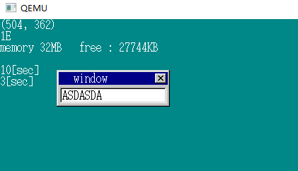
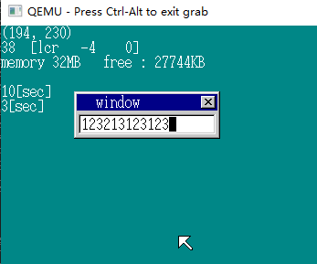
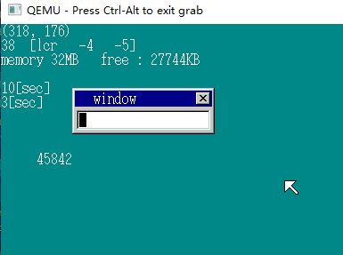
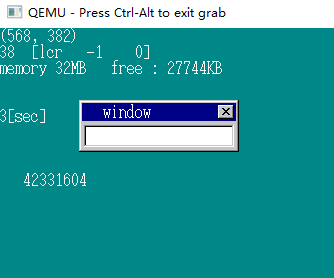
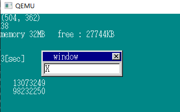
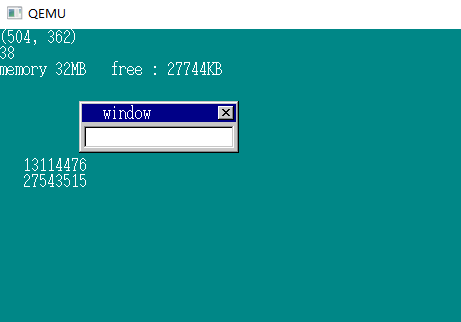

# 多任务（1）

## 1.挑战任务切换 

**多任务** Multitask 多个应用程序同时运行的状态

每个应用轮流运行，在一般的操作系统中，这个切换每 0.01~0.03s 就会执行一次。

切换任务时，CPU会将寄存器中的值全部写入内存（类似中断），这是为了切换回来的时候可以恢复运行。接下来，为了运行下一个程序，CPU会把所有寄存器的值从内存中读取出来（当然这个读取的地址和刚刚写入的地址一定是不同的），这就完成了一次切换。

**任务状态段** *task status segment*  TSS  有16位和32位两个版本

```C
struct TSS32 {
    // 与任务设置相关的信息
    // 执行任务的时候这些成员不会被写入（backlink除外）
	int backlink, esp0, ss0, esp1, ss1, esp2, ss2, cr3;
    // 32位寄存器
    // Extended Instruction Pointer 扩展指令指针寄存器 记录下一条指令的地址 PC值？
    // 每次执行EIP会自增 
    // JMP 指令 其实是向EIP赋值的指令
	int eip, eflags, eax, ecx, edx, ebx, esp, ebp, esi, edi;
	// 16位寄存器  
    int es, cs, ss, ds, fs, gs;
	// 有关设置的部分，因此在任务切换时不会被CPU写入
    // 先将ldtr置0，将iomap置为0x40000000
    int ldtr, iomap;
};
```

TSS包含 26 个 int，总共 104 BYTE。

任务切换，得使用JMP指令：

+ near模式 ： 改写EIP
+ far  模式 ：同时改写EIP和CS （code segment 代码段寄存器）切换文件

如果一条JMP指令所指定的目标地址段不是可执行的代码，而是TSS的话，CPU就不会执行改写EIP和CS的操作，而是将这条指令理解为任务切换，JMP到另一个任务。

CPU每次执行带有地址的指令时，都会去确定GDT的设置，以便判断接下来要执行的JMP指令到底是普通的far-JMP，还是任务切换。

HariMain：

```C
	struct TSS32 tss_a, tss_b;
	tss_a.ldtr = 0;
	tss_a.iomap = 0x40000000;
	tss_b.ldtr = 0;
	tss_b.iomap = 0x40000000;
	struct SEGMENT_DESCRIPTOR *gdt = (struct SEGMENT_DESCRIPTOR *) ADR_GDT;
	set_segmdesc(gdt + 3, 103, (int) &tss_a, AR_TSS32);
	set_segmdesc(gdt + 4, 103, (int) &tss_b, AR_TSS32);
	load_tr(3 * 8); // 3 * 8 是因为把刚才运行的任务定义为 gdt 的 3 号
	// tr 寄存器是让CPU记住正在运行的任务 task register 任务管理器
	// 需要 ltr 指令
	task_b_esp = memman_alloc_4k(memman, 64 * 1024) + 64 * 1024;
	tss_b.eip = (int) &task_b_main;
	tss_b.eflags = 0x00000202; /* IF = 1; */
	tss_b.eax = 0;
	tss_b.ecx = 0;
	tss_b.edx = 0;
	tss_b.ebx = 0;
	tss_b.esp = task_b_esp;
	tss_b.ebp = 0;
	tss_b.esi = 0;
	tss_b.edi = 0;
	tss_b.es = 1 * 8;
	tss_b.cs = 2 * 8; // cs 置为 GDT 的 2 号
	tss_b.ss = 1 * 8; // 其余均为 GDT 的 1 号
	tss_b.ds = 1 * 8; 
	tss_b.fs = 1 * 8;
	tss_b.gs = 1 * 8;
```

将tss_a定义在gdt的3号，段长限制103BYTE，tss_b同理。

naskfunc.nas:

```assembly
_load_tr:		; void load_tr(int tr);
		LTR		[ESP+4]			; tr
		RET
		; LTR 指令的作用是改变 TR 寄存器的值
_taskswitch4:	; void taskswitch4(void);
		JMP		4*8:0
		RET
		;跳转指令 
		; 如果far-JMP指令是用作任务切换的话，地址段（4*8部分）要指向TSS，而偏移量并没有实际作用。
```

```C
} else if (i == 10) {
    // 在10s后调用任务切换
    putfonts8_asc_sht(sht_back, 0, 64, COL8_FFFFFF, COL8_008484, "10[sec]", 7);
    taskswitch4();	
} else if (i == 3) {
```

```C
void task_b_main(void)
{
	for (;;) { io_hlt(); }
}
```



输入停止

## 2.任务切换进阶

```C
void task_b_main(void)
{
	struct FIFO32 fifo;
	struct TIMER *timer;
	int i, fifobuf[128];
	fifo32_init(&fifo, 128, fifobuf);
	timer = timer_alloc();
	timer_init(timer, &fifo, 1);
	timer_settime(timer, 500);
	for (;;) {
		io_cli();
		if (fifo32_status(&fifo) == 0) {
			io_sti();
			io_hlt();
		} else {
			i = fifo32_get(&fifo);
			io_sti();
			if (i == 1) { /* 超时时间为 5 s */
				taskswitch3(); /* 返回任务 A */
			}
		}
	}
}

```

```assembly
_taskswitch3:	; void taskswitch3(void);
		JMP		3*8:0
		RET
```




## 3.做个简单的多任务（1）

实现更快速的任务切换，不能写taskswitch3这样的函数，不然就要写几百个函数了，得写成一个函数：

```assembly
_farjmp:		; void farjmp(int eip, int cs);
		JMP		FAR	[ESP+4]				; eip, cs
		RET
```

JMP FAR 指令是执行 far 跳转。在JMP FAR指令中，可以指定一个内存地址，CPU会从指定的内存地址中读取4个字节的数据，并存入EIP寄存器，再继续读取2个字节的数据存入CS寄存器。当我们调用时，比如farjmp（eip，cs）；在[ESP+4]这个位置就存放了eip的值，而[ESP+8]则存放了cs的值，这样就可以实现far跳转了。

+ taskswitch3(); -----> farjmp(0, 3 * 8);
+ taskswitch4(); -----> farjmp(0, 4 * 8);

增加timer_ts变量，每隔0.02s执行一次任务切换。

```C
	timer_ts = timer_alloc();
	timer_init(timer_ts, &fifo, 2);
	timer_settime(timer_ts, 2);

	tss_b.eip = (int) &task_b_main;
	
	if (i == 2) {
		farjmp(0, 4 * 8);
		timer_settime(timer_ts, 2);
    }		
				
void task_b_main(void)
{
	struct FIFO32 fifo;
	struct TIMER *timer_ts;
	int i, fifobuf[128];

	fifo32_init(&fifo, 128, fifobuf);
	timer_ts = timer_alloc();
	timer_init(timer_ts, &fifo, 1);
	timer_settime(timer_ts, 2);

	for (;;) {
		io_cli();
		if (fifo32_status(&fifo) == 0) {
			io_sti();
			io_hlt();
		} else {
			i = fifo32_get(&fifo);
			io_sti();
			if (i == 1) { // 任务切换
				farjmp(0, 3 * 8);
				timer_settime(timer_ts, 2);
			}
		}
	}
}
```

## 4.做个简单的多任务（2）

让这个函数做些事：显示数字

```C
void task_b_main(void)
{
	struct FIFO32 fifo;
	struct TIMER *timer_ts;
	int i, fifobuf[128], count = 0;
	char s[11];
	struct SHEET *sht_back;
//--------------------------------------------------
	for (;;) {
        // 计时
		count++;
		sprintf(s, "%10d", count);
		putfonts8_asc_sht(sht_back, 0, 144, COL8_FFFFFF, COL8_008484, s, 10);
		io_cli();
		if (fifo32_status(&fifo) == 0) {
			io_sti();
		} else {
			// ------------------------------
			}
		}
	}
}
```

sht_back 存放在 0x0fec 这个地址上，也是 BOOTINFO-4



一直在切换！

## 5.提高运行速度

因为每次count++都会刷新界面，导致显示消耗了很多时间，而且人眼无法捕捉，所以我们每隔0.01s刷新一次屏幕：

```C
void task_b_main(struct SHEET *sht_back) // sht_back 作为参数传递了
{
	struct FIFO32 fifo;
	struct TIMER *timer_ts, *timer_put;
	int i, fifobuf[128], count = 0;
	char s[12];

	fifo32_init(&fifo, 128, fifobuf);
	timer_ts = timer_alloc();
	timer_init(timer_ts, &fifo, 2);
	timer_settime(timer_ts, 2);
	timer_put = timer_alloc();
	timer_init(timer_put, &fifo, 1);
	timer_settime(timer_put, 1);

	for (;;) {
		count++;
		io_cli();
		if (fifo32_status(&fifo) == 0) {
			io_sti();
		} else {
			i = fifo32_get(&fifo);
			io_sti();
			if (i == 1) {
				sprintf(s, "%11d", count);
				putfonts8_asc_sht(sht_back, 0, 144, COL8_FFFFFF, COL8_008484, s, 11);
				timer_settime(timer_put, 1);// 0.01 s
			} else if (i == 2) {
				farjmp(0, 3 * 8);
				timer_settime(timer_ts, 2); // 0.02 s
			}
		}
	}
}
```

```C
	task_b_esp = memman_alloc_4k(memman, 64 * 1024) + 64 * 1024 - 8;
	*((int *) (task_b_esp + 4)) = (int) sht_back;
```

这里已经提前在[ESP + 4]地址里放了sht_back的值，**注意**这里得减去8而不是4，否则会超出内存范围。



速度更快了！


为了记录正在执行的指令的地址，我们使用 EIP 寄存器，函数 return 的时候要返回的地址记录在ESP中，只要向 ESP 中写入一个合适的值，就可以“欺骗”CPU。

## 6.测试运行速度

```C
void task_b_main(struct SHEET *sht_back)
{
	struct FIFO32 fifo;
	struct TIMER *timer_ts, *timer_put, *timer_1s;
	int i, fifobuf[128], count = 0, count0 = 0;
	char s[12];

	fifo32_init(&fifo, 128, fifobuf);
	timer_ts = timer_alloc();
	timer_init(timer_ts, &fifo, 2);
	timer_settime(timer_ts, 2);
	timer_put = timer_alloc();
	timer_init(timer_put, &fifo, 1);
	timer_settime(timer_put, 1);
	timer_1s = timer_alloc();
	timer_init(timer_1s, &fifo, 100);
	timer_settime(timer_1s, 100);

	for (;;) {
		count++;
		io_cli();
		if (fifo32_status(&fifo) == 0) {
			io_sti();
		} else {
			i = fifo32_get(&fifo);
			io_sti();
			if (i == 1) {
				sprintf(s, "%11d", count);
				putfonts8_asc_sht(sht_back, 0, 144, COL8_FFFFFF, COL8_008484, s, 11);
				timer_settime(timer_put, 1);
			} else if (i == 2) {
				farjmp(0, 3 * 8);
				timer_settime(timer_ts, 2);
			} else if (i == 100) {
				sprintf(s, "%11d", count - count0);// 减去上一次到这里的值
				putfonts8_asc_sht(sht_back, 0, 128, COL8_FFFFFF, COL8_008484, s, 11);
				count0 = count;
				timer_settime(timer_1s, 100);
			}
		}
	}
}
```



每秒会显示count的增量。

## 7.多任务进阶

真正的多任务，要在程序本身不知道的情况下进行任务切换。

mtask.c

```C
#include "bootpack.h"
struct TIMER *mt_timer;
int mt_tr;
void mt_init(void)
{ 	// 初始化 mt_timer 和 mt_tr 的值，并将计时器设置为0.02s
	mt_timer = timer_alloc();
	/* timer_init没有必要使用 */
	timer_settime(mt_timer, 2);
	mt_tr = 3 * 8;
	return;
}
void mt_taskswitch(void)
{	// 按照当前的 mt_mr 的值计算下一个值，将计时器设置为0.02s，并进行任务切换
	if (mt_tr == 3 * 8) {
		mt_tr = 4 * 8;
	} else {
		mt_tr = 3 * 8;
	}
	timer_settime(mt_timer, 2);
	farjmp(0, mt_tr);
	return;
}
```

```C
void inthandler20(int *esp)
{
	struct TIMER *timer;
	char ts = 0;
	io_out8(PIC0_OCW2, 0x60);
	timerctl.count++;
	if (timerctl.next > timerctl.count) {
		return;
	}
	timer = timerctl.t0;
	for (;;) {
		if (timer->timeout > timerctl.count) {
			break;
		}
		timer->flags = TIMER_FLAGS_ALLOC;
		if (timer != mt_timer) {
			fifo32_put(timer->fifo, timer->data);
		} else {
			ts = 1; 
		}
		timer = timer->next;
	}
	timerctl.t0 = timer;
	timerctl.next = timer->timeout;
	if (ts != 0) {
		mt_taskswitch();
	}
	return;
}
```

如果产生超时的计时器是mt_timer的话，不向FIFO写入数据，而是将ts置为1。最后判断如果ts的值不为0，就调用mt_taskswitch进行任务切换。使用ts是为了防止在中断处理没有完成的时候，IF（中断允许标志）的值也可能被置为1。 所以要等所有中断程序完成后，再调用mt_taskswitch()。

```C
void task_b_main(struct SHEET *sht_back)
{
	struct FIFO32 fifo;
	struct TIMER *timer_put, *timer_1s;
	int i, fifobuf[128], count = 0, count0 = 0;
	char s[12];

	fifo32_init(&fifo, 128, fifobuf);
	timer_put = timer_alloc();
	timer_init(timer_put, &fifo, 1);
	timer_settime(timer_put, 1);
	timer_1s = timer_alloc();
	timer_init(timer_1s, &fifo, 100);
	timer_settime(timer_1s, 100);

	for (;;) {
		count++;
		io_cli();
		if (fifo32_status(&fifo) == 0) {
			io_sti();
		} else {
			i = fifo32_get(&fifo);
			io_sti();
			if (i == 1) {
				sprintf(s, "%11d", count);
				putfonts8_asc_sht(sht_back, 0, 144, COL8_FFFFFF, COL8_008484, s, 11);
				timer_settime(timer_put, 1);
			} else if (i == 100) {
				sprintf(s, "%11d", count - count0);
				putfonts8_asc_sht(sht_back, 0, 128, COL8_FFFFFF, COL8_008484, s, 11);
				count0 = count;
				timer_settime(timer_1s, 100);
			}
		}
	}
}
```



完美运行，即便在程序中不进行任务切换的处理，也一定会正常的完成切换。而且不使用FIFO缓冲区也加快了执行，对CPU的负担更小。


**DAY 15 FINISH**

**TAKR-Zz Happy！**

