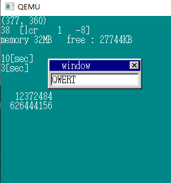
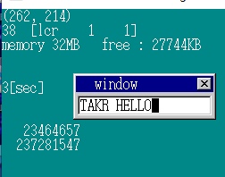
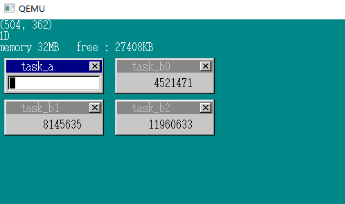
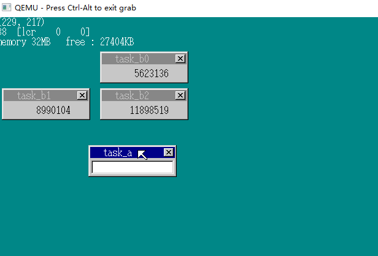

# 多任务（2）

## 1.任务管理自动化

在实现多个任务的时候，还需要改写mt_taskswitch的代码，向当初**定时器和窗口的做法一样**，利用一个数组将任务按顺序存放起来。

```C
#define MAX_TASKS		1000	/* 最大任务数 */
#define TASK_GDT0		3		/* 定义从GDT的几号开始分配给TSS */
struct TSS32 {
	int backlink, esp0, ss0, esp1, ss1, esp2, ss2, cr3;
	int eip, eflags, eax, ecx, edx, ebx, esp, ebp, esi, edi;
	int es, cs, ss, ds, fs, gs;
	int ldtr, iomap;
};
struct TASK {
	int sel, flags; /* sel用来存放GDT的编号 */
	struct TSS32 tss;
};
struct TASKCTL {
	int running; /* 正在运行的任务数量 */
	int now; /* 这个变量用来记录当前正在运行的是哪个任务 */
	struct TASK *tasks[MAX_TASKS];
	struct TASK tasks0[MAX_TASKS];
};
```

**mtask.c:**

```C
#include "bootpack.h"
struct TASKCTL *taskctl;
struct TIMER *task_timer;
struct TASK *task_init(struct MEMMAN *memman)
{
	int i;
	struct TASK *task;
	struct SEGMENT_DESCRIPTOR *gdt = (struct SEGMENT_DESCRIPTOR *) ADR_GDT;
	taskctl = (struct TASKCTL *) memman_alloc_4k(memman, sizeof (struct TASKCTL));
	for (i = 0; i < MAX_TASKS; i++) {
		taskctl->tasks0[i].flags = 0;
		taskctl->tasks0[i].sel = (TASK_GDT0 + i) * 8;
		set_segmdesc(gdt + TASK_GDT0 + i, 103, (int) &taskctl->tasks0[i].tss, AR_TSS32);
	}
	task = task_alloc();
	task->flags = 2; /* 活动中标志 */
	taskctl->running = 1;
	taskctl->now = 0;
	taskctl->tasks[0] = task;
	load_tr(task->sel);
	task_timer = timer_alloc();
	timer_settime(task_timer, 2);
	return task; // 返回一个task地址
}
struct TASK *task_alloc(void)
{
	int i;
	struct TASK *task;
	for (i = 0; i < MAX_TASKS; i++) {
		if (taskctl->tasks0[i].flags == 0) {
			task = &taskctl->tasks0[i];
			task->flags = 1; /* 使用中 */
			task->tss.eflags = 0x00000202; /* IF = 1; */
			task->tss.eax = 0; // 先设置为0
			task->tss.ecx = 0;
			task->tss.edx = 0;
			task->tss.ebx = 0;
			task->tss.ebp = 0;
			task->tss.esi = 0;
			task->tss.edi = 0;
			task->tss.es = 0;
			task->tss.ds = 0;
			task->tss.fs = 0;
			task->tss.gs = 0;
			task->tss.ldtr = 0;
			task->tss.iomap = 0x40000000;
			return task;
		}
	}
	return 0; /* 任务列表全部使用中 */
}
void task_run(struct TASK *task)
{	// 将 task 放置到末尾，然后使running++
	task->flags = 2; /* 活动中 = 2 */
	taskctl->tasks[taskctl->running] = task;
	taskctl->running++;
	return;
}
void task_switch(void)
{	// 用来代替task_switch
	timer_settime(task_timer, 2);
	if (taskctl->running >= 2) {
		taskctl->now++;
		if (taskctl->now == taskctl->running) {
			taskctl->now = 0;
		}
		farjmp(0, taskctl->tasks[taskctl->now]->sel);
	}
	return;
}
```

```C
	// HariMain() :
	task_init(memman);
	task_b = task_alloc();
	task_b->tss.esp = memman_alloc_4k(memman, 64 * 1024) + 64 * 1024 - 8;
	task_b->tss.eip = (int) &task_b_main;
	task_b->tss.es = 1 * 8;
	task_b->tss.cs = 2 * 8;
	task_b->tss.ss = 1 * 8;
	task_b->tss.ds = 1 * 8;
	task_b->tss.fs = 1 * 8;
	task_b->tss.gs = 1 * 8;
	*((int *) (task_b->tss.esp + 4)) = (int) sht_back;
	task_run(task_b);
```

实现很类似窗口的处理。



## 2.让任务休眠

我们目前实现的多任务，是让每个任务运行大约相同的时间，不过明显任务A空闲的时间较多，当任务B全力的输出count的时候，任务A的中断很少，只能HLT。如何避免浪费时间呢？

**将任务A从taskctl删除！**  称作 *sleep*  线程睡眠？

```C
void task_sleep(struct TASK *task)
{
	int i;
	char ts = 0;
	if (task->flags == 2) {		/* 如果指定任务处于唤醒状态 */
		if (task == taskctl->tasks[taskctl->now]) {
			ts = 1; /* 让自己休眠的话，稍后需要进行任务切换 */
		}
		/* 寻找task所在的位置 */
		for (i = 0; i < taskctl->running; i++) {
			if (taskctl->tasks[i] == task) {
				/* 在这里 */
				break;
			}
		}
		taskctl->running--;
		if (i < taskctl->now) {
			taskctl->now--; /* 需要移动成员，要相应地处理 */
		}
		/* 移动成员 */
		for (; i < taskctl->running; i++) {
			taskctl->tasks[i] = taskctl->tasks[i + 1];
		}
		task->flags = 1; /* 不工作的状态 */
		if (ts != 0) {
			/* 任务切换 */
			if (taskctl->now >= taskctl->running) {
				/* now的值出现异常就纠正 */
				taskctl->now = 0;
			}
			farjmp(0, taskctl->tasks[taskctl->now]->sel);
		}
	}
	return;
}
```

在FIFO中添加将任务唤醒的功能，需要添加任务的地址：

```C
struct FIFO32 {
	int *buf;
	int p, q, size, free, flags;
	struct TASK *task;
};
```

```C
void fifo32_init(struct FIFO32 *fifo, int size, int *buf, struct TASK *task)
/* FIFOバッファの初期化 */
{
	fifo->size = size;
	fifo->buf = buf;
	fifo->free = size;
	fifo->flags = 0;
	fifo->p = 0; 
	fifo->q = 0; 
	fifo->task = task; 
	return;
}
int fifo32_put(struct FIFO32 *fifo, int data)
{
	if (fifo->free == 0) {
		fifo->flags |= FLAGS_OVERRUN;
		return -1;
	}
	fifo->buf[fifo->p] = data;
	fifo->p++;
	if (fifo->p == fifo->size) {
		fifo->p = 0;
	}
	fifo->free--;
	if (fifo->task != 0) {
        // 增加了 run 的功能
		if (fifo->task->flags != 2) { 
			task_run(fifo->task); 
		}
	}
	return 0;
}
```

```C
// HariMain():
struct TASK *task_a, *task_b;
fifo32_init(&fifo, 128, fifobuf, 0);
task_a = task_init(memman);
fifo.task = task_a;
for (;;) {
	io_cli();
	if (fifo32_status(&fifo) == 0) {
		task_sleep(task_a);
		io_sti();
	} else {
        // -------------
    }
}
void task_b_main(struct SHEET *sht_back)
{
// --------------
	fifo32_init(&fifo, 128, fifobuf, 0);
//---------------
}
```

最开始的fifo32_init中指定任务的参数，都用0代替了，也就是禁用了自动唤醒的功能。



速度增快了！

## 3.增加窗口数量

增加更多的任务，去除了任务A的3s和10s计时。

```C
void HariMain(void)
{
	unsigned char *buf_back, buf_mouse[256], *buf_win, *buf_win_b;
	struct SHEET *sht_back, *sht_mouse, *sht_win, *sht_win_b[3];
	struct TASK *task_a, *task_b[3];
	struct TIMER *timer;
    // --------------------------------------------
	init_palette();
	shtctl = shtctl_init(memman, binfo->vram, binfo->scrnx, binfo->scrny);
	task_a = task_init(memman);
	fifo.task = task_a;
    
	/* sht_back */
	sht_back  = sheet_alloc(shtctl);
	buf_back  = (unsigned char *) memman_alloc_4k(memman, binfo->scrnx * binfo->scrny);
	sheet_setbuf(sht_back, buf_back, binfo->scrnx, binfo->scrny, -1); /* 无透明色 */
	init_screen8(buf_back, binfo->scrnx, binfo->scrny);

	/* sht_win_b */
	for (i = 0; i < 3; i++) {
		sht_win_b[i] = sheet_alloc(shtctl);
		buf_win_b = (unsigned char *) memman_alloc_4k(memman, 144 * 52);
		sheet_setbuf(sht_win_b[i], buf_win_b, 144, 52, -1); /* 无透明色 */
		sprintf(s, "task_b%d", i);
		make_window8(buf_win_b, 144, 52, s, 0);
		task_b[i] = task_alloc();
		task_b[i]->tss.esp = memman_alloc_4k(memman, 64 * 1024) + 64 * 1024 - 8;
		task_b[i]->tss.eip = (int) &task_b_main;
		task_b[i]->tss.es = 1 * 8;
		task_b[i]->tss.cs = 2 * 8;
		task_b[i]->tss.ss = 1 * 8;
		task_b[i]->tss.ds = 1 * 8;
		task_b[i]->tss.fs = 1 * 8;
		task_b[i]->tss.gs = 1 * 8;
		*((int *) (task_b[i]->tss.esp + 4)) = (int) sht_win_b[i];
		task_run(task_b[i]);
	}

	/* sht_win */
	sht_win   = sheet_alloc(shtctl);
	buf_win   = (unsigned char *) memman_alloc_4k(memman, 160 * 52);
	sheet_setbuf(sht_win, buf_win, 144, 52, -1); /* 无透明色 */
	make_window8(buf_win, 144, 52, "task_a", 1);
	make_textbox8(sht_win, 8, 28, 128, 16, COL8_FFFFFF);
	cursor_x = 8;
	cursor_c = COL8_FFFFFF;
	timer = timer_alloc();
	timer_init(timer, &fifo, 1);
	timer_settime(timer, 50);

	/* sht_mouse */
	sht_mouse = sheet_alloc(shtctl);
	sheet_setbuf(sht_mouse, buf_mouse, 16, 16, 99);
	init_mouse_cursor8(buf_mouse, 99);
	mx = (binfo->scrnx - 16) / 2; 
	my = (binfo->scrny - 28 - 16) / 2;

	sheet_slide(sht_back, 0, 0);
	sheet_slide(sht_win_b[0], 168,  56);
	sheet_slide(sht_win_b[1],   8, 116);
	sheet_slide(sht_win_b[2], 168, 116);
	sheet_slide(sht_win,        8,  56);
	sheet_slide(sht_mouse, mx, my);
	sheet_updown(sht_back,     0);
	sheet_updown(sht_win_b[0], 1);
	sheet_updown(sht_win_b[1], 2);
	sheet_updown(sht_win_b[2], 3);
	sheet_updown(sht_win,      4);
	sheet_updown(sht_mouse,    5);
	sprintf(s, "(%3d, %3d)", mx, my);
	putfonts8_asc_sht(sht_back, 0, 0, COL8_FFFFFF, COL8_008484, s, 10);
	sprintf(s, "memory %dMB   free : %dKB",
			memtotal / (1024 * 1024), memman_total(memman) / 1024);
	putfonts8_asc_sht(sht_back, 0, 32, COL8_FFFFFF, COL8_008484, s, 40);

	for (;;) {
		io_cli();
		if (fifo32_status(&fifo) == 0) {
			task_sleep(task_a);
			io_sti();
		} else {
			i = fifo32_get(&fifo);
			io_sti();
			if (256 <= i && i <= 511) { /* 键盘 */
                // ---------------------------------
			} else if (512 <= i && i <= 767) { /* mouse */
				//	---------------------------
			} else if (i <= 1) { /* 光标定时器 */
			}
		}
	}
}
void make_window8(unsigned char *buf, int xsize, int ysize, char *title, char act)
{ 		// 增加参数 act
	static char closebtn[14][16] = {
		"OOOOOOOOOOOOOOO@",
		"OQQQQQQQQQQQQQ$@",
		"OQQQQQQQQQQQQQ$@",
		"OQQQ@@QQQQ@@QQ$@",
		"OQQQQ@@QQ@@QQQ$@",
		"OQQQQQ@@@@QQQQ$@",
		"OQQQQQQ@@QQQQQ$@",
		"OQQQQQ@@@@QQQQ$@",
		"OQQQQ@@QQ@@QQQ$@",
		"OQQQ@@QQQQ@@QQ$@",
		"OQQQQQQQQQQQQQ$@",
		"OQQQQQQQQQQQQQ$@",
		"O$$$$$$$$$$$$$$@",
		"@@@@@@@@@@@@@@@@"
	};
	int x, y;
	char c, tc, tbc;
    // 当act==1 颜色不变
	if (act != 0) {
		tc = COL8_FFFFFF;
		tbc = COL8_000084;
	} else {
        // act == 0 窗口的标题栏变成灰色
		tc = COL8_C6C6C6;
		tbc = COL8_848484;
	}
	boxfill8(buf, xsize, COL8_C6C6C6, 0,         0,         xsize - 1, 0        );
	boxfill8(buf, xsize, COL8_FFFFFF, 1,         1,         xsize - 2, 1        );
	boxfill8(buf, xsize, COL8_C6C6C6, 0,         0,         0,         ysize - 1);
	boxfill8(buf, xsize, COL8_FFFFFF, 1,         1,         1,         ysize - 2);
	boxfill8(buf, xsize, COL8_848484, xsize - 2, 1,         xsize - 2, ysize - 2);
	boxfill8(buf, xsize, COL8_000000, xsize - 1, 0,         xsize - 1, ysize - 1);
	boxfill8(buf, xsize, COL8_C6C6C6, 2,         2,         xsize - 3, ysize - 3);
	boxfill8(buf, xsize, tbc,         3,         3,         xsize - 4, 20       );
	boxfill8(buf, xsize, COL8_848484, 1,         ysize - 2, xsize - 2, ysize - 2);
	boxfill8(buf, xsize, COL8_000000, 0,         ysize - 1, xsize - 1, ysize - 1);
	putfonts8_asc(buf, xsize, 24, 4, tc, title);
	for (y = 0; y < 14; y++) {
		for (x = 0; x < 16; x++) {
			c = closebtn[y][x];
			if (c == '@') {
				c = COL8_000000;
			} else if (c == '$') {
				c = COL8_848484;
			} else if (c == 'Q') {
				c = COL8_C6C6C6;
			} else {
				c = COL8_FFFFFF;
			}
			buf[(5 + y) * xsize + (xsize - 21 + x)] = c;
		}
	}
	return;
}
```


3个窗口的运行时间几乎相同，但依旧没有完成窗口的选择。

## 4.设定任务优先级（1）

有些时候我们需要提升或降低任务的优先级，因此接下来我们要是实现这样的功能：

```C
struct TASK {
	int sel, flags; 
	int priority;
	struct TSS32 tss;
};
```

利用priority实现每个任务在0.01s到0.1s的范围内设置不同的时钟，就能实现最大10倍的优先级差异。

```C
struct TASK *task_init(struct MEMMAN *memman)
{
	int i;
	struct TASK *task;
	struct SEGMENT_DESCRIPTOR *gdt = (struct SEGMENT_DESCRIPTOR *) ADR_GDT;
	taskctl = (struct TASKCTL *) memman_alloc_4k(memman, sizeof (struct TASKCTL));
	for (i = 0; i < MAX_TASKS; i++) {
		taskctl->tasks0[i].flags = 0;
		taskctl->tasks0[i].sel = (TASK_GDT0 + i) * 8;
		set_segmdesc(gdt + TASK_GDT0 + i, 103, (int) &taskctl->tasks0[i].tss, AR_TSS32);
	}
	task = task_alloc();
	task->flags = 2; 
	task->priority = 2; /* 默认 0.02s */
	taskctl->running = 1;
	taskctl->now = 0;
	taskctl->tasks[0] = task;
	load_tr(task->sel);
	task_timer = timer_alloc();
	timer_settime(task_timer, task->priority);
	return task;
}
void task_run(struct TASK *task, int priority)
{
	if (priority > 0) {
        // 设定优先级
		task->priority = priority;
	}
	if (task->flags != 2) {
		task->flags = 2; 
		taskctl->tasks[taskctl->running] = task;
		taskctl->running++;
	}
	return;
}
```

当priority为0是则表示不改变当前已经设定的优先级。这样的设计是为了在唤醒睡眠任务的时候使用。

```C
void task_switch(void)
{
	struct TASK *task;
	taskctl->now++;
	if (taskctl->now == taskctl->running) {
		taskctl->now = 0;
	}
	task = taskctl->tasks[taskctl->now];
	timer_settime(task_timer, task->priority);
	if (taskctl->running >= 2) {
		farjmp(0, task->sel);
	}
	return;
}
```

利用priority设置timer_settime（）

HariMain（）：

```C
for (i = 0; i < 3; i++) {
    	// ------------
		task_run(task_b[i], i + 1);
}
```



比例近似1：2：3   **成功！ ** 但鼠标移动十分卡顿

## 5.设定任务优先级（2）

将任务A的优先级设置为10，当任务A执行完成后会自动休眠，不会过多的浪费时间，鼠标的流畅性就保证了。

**总结：** 任务的优先级是一个好东西，在操作系统中的某一些处理，要牺牲其他任务的性能而尽快满足，比如中断，对于这类任务，我们可以让他们在结束后立即休眠，而优先级可以设置的很高。但是依旧可能出现相同优先级的任务运行出现紊乱。

**新架构：** 在TASKCTL中建立多个 tasks[ ] ，每一层进行优先级区分，先在最上层中进行进程切换，而忽略下面进程的任务，（*类似操作系统中的优先级队列？*） 

```C
struct TASK *task_now(void)
{
	struct TASKLEVEL *tl = &taskctl->level[taskctl->now_lv];
	return tl->tasks[tl->now];
}
void task_add(struct TASK *task)
{
	struct TASKLEVEL *tl = &taskctl->level[task->level];
	tl->tasks[tl->running] = task;
	tl->running++;
	task->flags = 2; /* 运行中 */
	return;
}
void task_remove(struct TASK *task)
{
	int i;
	struct TASKLEVEL *tl = &taskctl->level[task->level];
	for (i = 0; i < tl->running; i++) {
		if (tl->tasks[i] == task) {
			break;
		}
	}
	tl->running--;
	if (i < tl->now) {
		tl->now--;
	}
	if (tl->now >= tl->running) {
		tl->now = 0;
	}
	task->flags = 1;
	for (; i < tl->running; i++) {
		tl->tasks[i] = tl->tasks[i + 1];
	}
	return;
}
void task_switchsub(void)
{
	int i;
    // 寻找最上层的LEVEL
	for (i = 0; i < MAX_TASKLEVELS; i++) {
		if (taskctl->level[i].running > 0) {
			break; 
		}
	}
	taskctl->now_lv = i;
	taskctl->lv_change = 0;
	return;
}
```

```C
struct TASK *task_init(struct MEMMAN *memman)
{
	int i;
	struct TASK *task;
	struct SEGMENT_DESCRIPTOR *gdt = (struct SEGMENT_DESCRIPTOR *) ADR_GDT;
	taskctl = (struct TASKCTL *) memman_alloc_4k(memman, sizeof (struct TASKCTL));
	for (i = 0; i < MAX_TASKS; i++) {
		taskctl->tasks0[i].flags = 0;
		taskctl->tasks0[i].sel = (TASK_GDT0 + i) * 8;
		set_segmdesc(gdt + TASK_GDT0 + i, 103, (int) &taskctl->tasks0[i].tss, AR_TSS32);
	}
	for (i = 0; i < MAX_TASKLEVELS; i++) {
		taskctl->level[i].running = 0;
		taskctl->level[i].now = 0;
	}
	task = task_alloc();
	task->flags = 2;	
	task->priority = 2; 
	task->level = 0;	
	task_add(task);
	task_switchsub();	
	load_tr(task->sel);
	task_timer = timer_alloc();
	timer_settime(task_timer, task->priority);
	return task;
}
struct TASK *task_alloc(void)
{
	int i;
	struct TASK *task;
	for (i = 0; i < MAX_TASKS; i++) {
		if (taskctl->tasks0[i].flags == 0) {
			task = &taskctl->tasks0[i];
			task->flags = 1; 
			task->tss.eflags = 0x00000202; 
			task->tss.eax = 0; 
			task->tss.ecx = 0;
			task->tss.edx = 0;
			task->tss.ebx = 0;
			task->tss.ebp = 0;
			task->tss.esi = 0;
			task->tss.edi = 0;
			task->tss.es = 0;
			task->tss.ds = 0;
			task->tss.fs = 0;
			task->tss.gs = 0;
			task->tss.ldtr = 0;
			task->tss.iomap = 0x40000000;
			return task;
		}
	}
	return 0; 
}
void task_run(struct TASK *task, int level, int priority)
{
	if (level < 0) {
		level = task->level; 
	}
	if (priority > 0) {
		task->priority = priority;
	}
	if (task->flags == 2 && task->level != level) { 
		task_remove(task); 
	}
	if (task->flags != 2) {
		task->level = level;
		task_add(task);
	}
	taskctl->lv_change = 1; 
	return;
}
void task_sleep(struct TASK *task)
{
	struct TASK *now_task;
	if (task->flags == 2) {
        now_task = task_now();
		task_remove(task); 
		if (task == now_task) {
			task_switchsub();
			now_task = task_now(); 
			farjmp(0, now_task->sel);
		}
	}
	return;
}
void task_switch(void)
{
	struct TASKLEVEL *tl = &taskctl->level[taskctl->now_lv];
	struct TASK *new_task, *now_task = tl->tasks[tl->now];
	tl->now++;
	if (tl->now == tl->running) {
		tl->now = 0;
	}
	if (taskctl->lv_change != 0) {
		task_switchsub();
		tl = &taskctl->level[taskctl->now_lv];
	}
	new_task = tl->tasks[tl->now];
	timer_settime(task_timer, new_task->priority);
	if (new_task != now_task) {
		farjmp(0, new_task->sel);
	}
	return;
}
```

开始的时候只有LEVEL0一个任务，因此我们按照这样的方式来初始化，我们需要在下一次任务切换时检查LEVEL，将lv_change置为1 。




**DAY 16 FINISH**

**TAKR-Zz** 